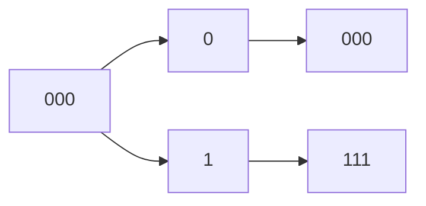

| d4  | d3  | d2  | p4  | d1  | p2  | p1  |
| --- | --- | --- | --- | --- | --- | --- |
| 1   | 0   | 1   |     | 1   |     |     |

p1:
1, 1, 1 = 1
p2:
1, 1, 0 = 0
p4:
1, 1, = 0

| d4  | d3  | d2  | p4  | d1  | p2  | p1  |
| --- | --- | --- | --- | --- | --- | --- |
| 0   | 0   | 0   | 0   | 1   | 1   | 1   |

p1:
1, 0, 0 = 1
p2:
1, 0, 0 = 1
p4:
0 0 0 = 0

0.3 -3.4 kHz
usable range -> 3.1 kHz
with guard band -> 4 kHz
2 channel, per channel ko 8 bit = 4 * 16 = 64 kB
24 ota channel -> 1536

states: [s2] [s1] [s0]
nth -> nth state
n+1 -> nth state +1

q0$^{(n+1)}$ = i + s2 + s1 + s0
q1$^{n+1}$ = i +s1 + s0
q2$^{n+1}$ = i + s0

