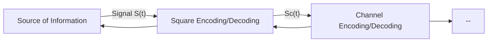
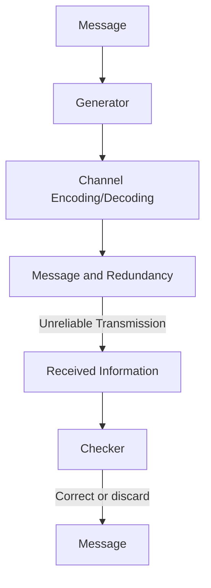
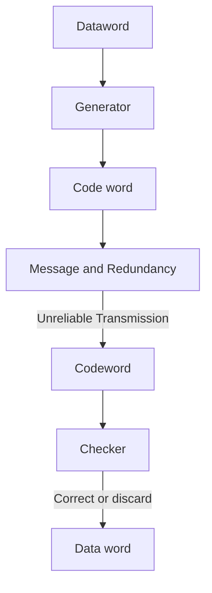

# FM
$$S_m(t) = A_m \sin(\omega t)$$
$$S_c(t)=A_c\sin(\omega t)$$
$$S_{FM} = A\ \sin(\omega_c\ t +\ S_m(t))$$
$$for\ i^{th}\ order,\ J_i(m)$$ where m is modulation index.
Even and odd separated
- Deviation, $f_{\Delta}$ 
- modulation index = $\dfrac{f_{\Delta}}{f_m}$ 
- e= $A\sin(\omega_c t + m_f \sin(\omega_m t))$ 
- = $$A(J_0 \sin(\omega_c t)\ +\ J_1\ (m_f)\ [\sin((\omega_c + \omega_m)t) - \sin((\omega_c\ -\ \omega_m)t)]\ +\ J_2\ (m_f)\ [\sin((\omega_c + 2\omega_m)t) - \sin((\omega_c\ +\ 2\omega_m)t)])$$
- Bandwidth in which most of the energy of the wave is contained in then twice this value
- $$B\omega_{FM} = 2[m_f+1] = 2\left[\dfrac{f_{\Delta}}{f_m} +1 n \right]$$
# PCM
**Uses**
- Sampling
- Quantization
- Coding
## 1. PAM
(Pulse Amplitude Modulated) Signal
## 2. PWM
(Pulse width modulation)
## 3. PPM
(Pulse position modulation)

---
## Digital to Analog
### ASK
(Amplitude Shift Keying)
- Digital Bit stream b(t)
- Carrier stream c(t)
- Also called On Off Keying
- Amplitude exists: logical 1
- Amplitude ~exists: logical 0
- c(t) of high frequency
- c(t) ^ b(t) = ASK       
### FSK
(Frequency Shift Keying)
- low frequency = 0
- high frequency = 1
### PSK
(Phase Shift Keying)
- popular
- different phase are used for bit 0, 1
- Constellation diagram
	- 
### QAM
(Quadrature Amplitude Modulation)

---
for multiple bits (M), we use M-ary modulation
Specification for the modulation
- Symbols
- Bandwidth
- Data rate
- Spectral efficiency (b/s/Hz)
- SNR
- Peak-to-peak SNR (PSNR)
- Noise probability
- Distortion probability
Another shift keying: MSK (minimum shift keying)
GMSK (Gaussian Minimum Shift Keying)
- Q and I channel
## Pre emphasis, and De emphasis
- in FM, before: PE
- in FM (demodulation), before: DE
- filter ckts
- PE are highpass
- DE are lowpass
- for pre emphasis:
	- lower cutoff 20Hz
	- upper cutoff 3kHz
- for de emphasis:
	- lower cutoff at $\alpha_{max}$ = 21-22Hz
- adv:
	- increases BW, SNR, channel capacity
- disadv:
	- cost
	- one requires the other
## Transmission System

## Channel Encoding
## A. Topics
### 1. Types
1. Random
2. Burst
### 2. Redundancy
### 3. Detection versus Correction
### 4. Forward Error Correction versus Retransmission
### 5. Coding
### 6. Modular Arithmetic
- Forouzan
- two types
	1. Error Detection
	2. Error Correction

## B. Block coding
- message into k bit block, called data word.
- add r redundant bits to each block to make the length n = k + r
- n-bit blocks are called codewords.

### Hamming distance
- for d(000, 011) is 2 because:
	- 000 XOR 011 = 011, two 1's.
	- so distance = 2
- for minimum hamming distance
	- find all distance, whichever minimum is d$_m$
	- to guarantee the detection of upto s errors in all cases, the minimum hamming distance in a block code must be d$_{min}$ = s + 1
	- to guarantee correction of upto t errors in all cases, the minimum hamming distance in a block code must be d$_{min}$ = 2t + 1
## Linear Block Coding
- The XOR of any two valid codewords create another valid codeword.
- C(5, 4), code word of 5 bit, 4 bit of data word
- generator generates parity bit, called syndrom in checker's block.
## Error detection Codes
### 1. 2D Parity
- Vertical Redundancy Check (VRC) -vertically check row by row
- Lateral Redundancy Check (LRC) - horizontally check column by column
- three errors affect four parities
- four errors cannot be detected
### 2. Cyclic Codes
- assume 101101 is a block
	- now, shift bits
	- check bits
	- and shift and check
	- if error is found, then dmin is found, wherever the hamming distance is minimum, accept that
		- or else, accept only if 0.
	- rotate by s-1
1. CRC-3 (r-bit redundancy in CRC-r)
2. Checksum
## Error correction Codes
1. Linear Block Coding (LBC)
2. Hamming Codes
3. Convolutional Codes
4. Not required: Turbo Codes
## 1. LBC
### 10.4 CRC
- divisor is shared between sender and receiver.
	- used as private keys
### Systematic Cyclic code
- question
	- generator polynomial:
		  g(x) = 1 + x + x$^3$, i.e. 1011
	- message: 0101
	- codeword c(7, 4) = ? 
- solution:
	- message bits = 4
	- m, k
	- q =3
	- $\text{X}^q = x^3$
	- $x^3(m)$
	- $x^3(x^2+1)$
	- $x^5 + x^3$
	- divide:
		- g(x) | $x^3 (m)$ |
		- 1011 | 101000 |  100
		-           1011
		-           ------------
		-           000100
	- message = 0101100
	- in the form of C(7,4)
---
- Discuss the procedure for generation of systematic cyclic code. Draw and explain the SCC encoder circuit for C(15, 9) cyclic code, with generator polynomial g(x) = 1 + x$^3$ + x$^4$ + x$^5$ + x$^6$