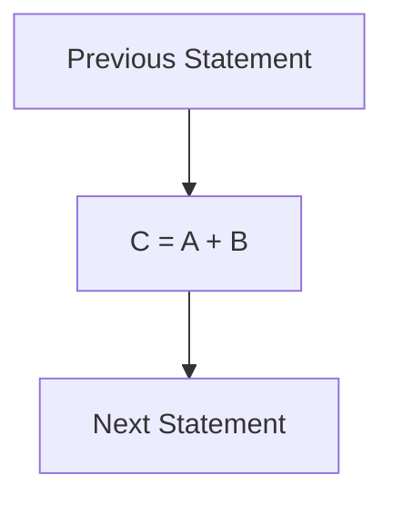

- **4 Hours**
- **8 Marks**
# 1 Combination Logic
- digital circuit whose output is purely a function of its present inputs.
- combination logic circuits are made up from basic gates or universal gates that are combined or connected together to produce more complex switching circuits.
- in general, logic gates are the building blocks of combinational logic cricuits.
- it has no memory block
- some of the examples of the combinational circuits are decoder, multiplexer, adder, ROM, etc.
## 1.1 CMOS Transistor
- a transistor which acts as a simple on/off switch, is the basic electrical component in digital system.
- more abstract components, logic gates, are formed with the combination of transistors.
- in complementary metal oxide semiconductor (CMOS) the gate voltage controls the flow of current from source to drain.
- the nMOS conducts when gate is at high voltage (5V) whereas pMOS conducts when gate is at low voltage (0V).
- the symbol for nMOS and pMOS is shown in the figure:
	- ![[Pasted image 20260223200255.png]]
- Different gate ans boolean functions can be realized using nMOS and pMOS
### 1.1.1 Inverter
- when x = 0, transistor T1 conducts but T2 doesn't.
- so output is logic 1.
- when x = 1, T2 conducts but T1 doesn't.
- x = input
- x' = output.
- figure:
	- ![[Pasted image 20260223200411.png]]
### 1.1.2 NOR
- when x = 0 and y = 0, then T1 and T2 conduct but T3 and T4 don't.
	- So, F is connected to VCC
- when x = 1 and y = 0, T2 and T3 conduct but T1 and T4 don't.
- When x = 0, and y = 1, T1 and T4 conduct but T2 and T3 don't.
- When x = 1, and y = 1, T3 and T4 conduct, but T1 and T2 don't.
	- So F is connected to ground.
- when atleast one of the two inputs is high then the output is connected to ground.
- and when both inputs are low, then the output is connected to VCC.
- figure
	- ![[Pasted image 20260223200612.png]]
### 1.1.3 NAND Gate
- when x = 0 and y = 0, then T1 and T2 conduct but T3 and T3 don't. So F is connected to VCC
- when x = 1, and y = 0, then T2 and T3 conduct but T1 and T4 don't.
	- So F is connected to VCC
- when x = 0 and y = 1, then T1 and T4 conduct but T2 and T3 don't.
	- so F is connected to VCC
- When x = 1 and y = 1 then T3 and T4 conduct but T1 and T2 don't.
	- So, F is connected to ground.
- When atleast one out of two inputs is low then the output is connected to VCC.
- and when both inputs are high then the output is connected to the ground.
## 1.2 Basic Logic Gates
- The NOT (inverter) gate simply complements the output
- the AND gate outputs 1 if and only if all of its inputs are `
- The OR gate outputs 1 if its atleast one of its inputs is 1.
- the XOR gate outputs 1 when only one of its input is 1.
- the NAND, NOR and XNOR gates output the complement of AND, OR and XOR respectively.
## 1.3 Basic Combinational Logic Design
- output is rarely a function of its present inputs and has no memory of past inputs
- we can use basic logic gates to design combinational circuits.
- in such design, outputs are described in terms of inputs.
- general steps for comibational logic design
	- the description is translated into a truth table with all possible combinations fo input values
	- the input values lies on the left of the truth table and the corresponding output values of the inputs lie on the right of the truth table.
	- for each output, we have to derive the equations
	- the equations may contain number of combinations of the inputs.
	- the number of combinations depends on the number of high (1) value on each column of the output.
	- rows of the inputs are used to derive the equation corresponding to the high output of the column.
	- and the equation must be further minimized
	- another way is to derive minimzed equation directly is by using k-map.
	- always better to use k-map unless the design is too simple (when the output column consists of only one high value)
	- the final equation is translated to an equivalent circuit diagram using logic gates.
### 1.3.1 Combination Logic Design Example
#### 1.3.1.1 Example 1
- in an alarm system of a bank, three sensors are implemented and the alarm is triggered when at least two sensors detect the change.
- assuming sensors to output digital values, design a combinational logic circuit for alarm system
#### 1.3.1.2 Solution
- let a, b, c represent the three sensors and y represent the buzzer for alarm.
- the output should be high when two or more than two inputs are high.
- the truth table and its corresponding combinational design are shown below
#### 1.3.1.3 Truth Table
| a   | b   | c   | y   |
| --- | --- | --- | --- |
| 0   | 0   | 0   | 0   |
| 0   | 0   | 1   | 0   |
| 0   | 1   | 0   | 0   |
| 0   | 1   | 1   | 1   |
| 1   | 0   | 0   | 0   |
| 1   | 0   | 1   | 1   |
| 1   | 1   | 0   | 1   |
| 1   | 1   | 1   | 1   |
#### 1.3.1.4 K-Map
| y\bc | 00  | 01  | 11  | 10  |
| ---- | --- | --- | --- | --- |
| 0    | 0   | 0   | 0   | 1   |
| 1    | 0   | 1   | 1   | 1   |
y = ac+bc'
## 1.4 RT-Level Combinational Components
- Register-transfer or RT level components are generally used when the design of the circuit becomes complex. 
- As the number of input increases, the complexity of the design increase.
- one of the ways to reduce design complexities is by using RT-level components.
- Mux, decoder, adder are the examples of RT-level components
- Example in figure:
	- ![[Pasted image 20260223204159.png]]
### 1.4.1 Mux
- allows only one of its data inputs to pass through to the output.
- for m x 1 multiplexer, there are m data inputs
	- one data output
	- with log$_2$ m output.
	- it can be used for parallel to serial conversion
### 1.4.2 Decoder
- allows exactly one of the output lines to be high at a given time for a particular input.
- for n input lines there will be 2$^n$ output lines.
- a decoder can be used for coding the addressing lines in the memory.
- can be used to convert binary to a suitable form.
### 1.4.3 Adder
- used to add two n-bit inputs producing an n-bit sum along with a carry of 1 bit
### 1.4.4 Comparator
- allows to compare two n-bit binary inputs
- generating the corresponding output based on whether one input is less than, equal to, or greater than another input.
### 1.4.5 ALU
- performs a variety of arithmetic and logic functions on its n-bit inputs
- the select line is used to select which function is to be carried out.
- if there are 2$^m$ functions that can be done by ALU then there must be atleast m select lines.
### 1.4.6 Shifter
- Shifter is another example which is used to shift the bits of the input right or left.
- it can be used as a divider or multiplier.
- for example shifting 0110 (6) to the right would give 0011 (3).
---
# 2 Sequential Logic
- A sequential circuit is a digital circuit whose outputs are a function of not only the present inputs, but also the pasts.
- the output of a sequential ogic depends on its present internal state and the present inputs.
- hence a sequential logic circuit has some kind of memory.
- logic gates and flip flops are the basic building blocks of sequential logic circuits.
- Flip flop is an example of sequential logic circuit.
- a small triangle in the block represents the clock input for any sequential logic.
- control inputs in a sequential logic can be either synchronus or asynchronous.
- a synchronous input value only has an effect during a clock edge while an asynchronous input value affects the circuit independent of the clock.
- clear control lines are asynchronous inputs while load, shift count control lines are synchronous inputs.
- example block diagrams:
	- ![[Pasted image 20260223210247.png]]
### 2.1.1 Flip Flop
- A flip flop stores a single bit.
- types of Flip flops are listed below
- flip flops are generally designed to be edge triggered to prevent the unexpected behavior from signal glitches, the inputs are checked either at the rising edge or falling edge of the clock.
- glitches represent an undesirable transition that occurs before the signal settles to its intended value.
#### 2.1.1.1 D Flip flop
- it has two inputs D and clock.
- when clock is high, value of D is stored in flip flop
- same will be value of the output Q
- when clock is low, previously stored bit is maintained ignoring the valuae of input D.
#### 2.1.1.2 SR Flip Flop
- has 3 inputs S (set), R (reset) and clock
- when clock is low, the previously stored bit is maintained ignoring the values of input at S and R.
- When clock is high, the output varies with inputs S and R.
- if S is high, the output Q will be high and high-bit (1) will be stored by the flip-flop.
- if R is high, then low bit (0) will be stored.
- the output will not change if both the inputs are low but the undefined condition will occur if both the inputs are high.
#### 2.1.1.3 JK Flip Flop
- its operation is similar to that of SR flip flop
- when both inputs J and K is high, the stored bit toggles, either from high to low or low to high.
### 2.1.2 RT level Sequential Components
#### 2.1.2.1 Register
- stores n bits from n bit data input which also appears at its output.
- A register usually has atleast 2 control inputs, clock and load
- for a rising edge triggered register
	- the inputs are only stored when load is high and clock is rising from 0 to 1.
- another control input clear may be used to resets all bits to 0 regardless of the value of input.
- since all n bits of the registerrs can be stored in parallel, we refer this type of register as a parallel load register.
#### 2.1.2.2 Shift Register
- stores n bit from its one bit data input with atleast two control inputs clock and shift
- when clock is rising, and shift is 1
	- the nth bit of input is stored in the (n-1)$^{th}$ bit
	- and (n-1)$^{th}$ bit is stored in the (n-2)$^{th}$ bit and so on down to the second bit being stored in the first bit.
	- the first bit is shifted out appearing as an output bit.
	- it has one bit output and the input must be shifted into the register serially.
#### 2.1.2.3 Counter
- counter is a register that adds binary 1 to its stored binary value.
- in general, a counter has a clear, count and load as a control inputs.
- clear resets all stored bits to 0 and a count input enables incrementing on each clock edge.
- it often has parallel load data input and associated load control signal.
- a common counter feature is both up and down counting which required an additional control input to indicate the count direction.
## 2.2 Sequential Logic Design
1. Translate the problem description to a state diagram, also called FSM
2. each circle represents a state where desired output values are listed next to each.
	- whereas the input conditions which cause a transition from one state to another are listed next to each arc.
3. draw an implementation model which implements the FSM using a state register to store the current state and combinational logic to generate the required output values and next state.
4. Assign each state a unique binary value, and create a truth tbale for the combinational logic.
	- the external inputs and the bits coming from the state registers are fed to the combinational logic as inputs.
	- whereas, teh external output values along with the state bits to be loaded into the state register acts as the output of the combinational logic.
5. The output values change only with the current state, so we list the external output values only for each possible state, regardless of teh change in external input values.
6. now we can have a truth table, with the help of which we can proceed with combianational design by generating minimized output equations using k-map
	- and finally, drawing the combinational logic circuit.
### 2.2.1 Sequential logic design Example
#### 2.2.1.1 Example 1
- Design a soda machine controller, given that a soda costs 75 Cents and your machine accepts quarters only.
- Draw a black box view, come up with a state diagram and state table, minimize teh logic and then draw the final circuit.
#### 2.2.1.2 Solution
- the coin must be entered three times to get a soda out of the machine.
- throughout the design, Cin represents the coin input and Sout indicates the soda output whereas Q1, Q0 represent current state and I1 and I0 represent next state.
#### 2.2.1.3 Black box view
```
┌------------------┐
|   Soda Machine   |------> Sout
|    Controller    |<------ Cin
└------------------┘
```
#### 2.2.1.4 State Diagram
1. (0: Sout = 0) -- (Cin = 1) -> (1: Sout = 0)
2. (1: Sout = 0) -- (Cin = 1) -> (2: Sout = 0)
3. (2: Sout = 0) -- (Cin = 1) -> (3: Sout = 1)
4. (3: Sout = 1) -- (Cin = 0) -> (0: Sout = 0)
5. (3: Sout = 1) -- (Cin = 1) -> (1: Sout = 0)
6. (0: Sout = 0) -- (Cin = 0) -> (0: Sout = 0)
7. (1: Sout = 0) -- (Cin = 0) -> (1: Sout = 0)
8. (2: Sout = 0) -- (Cin = 0) -> (2: Sout = 0)
#### 2.2.1.5 State Table
| Q1  | Q0  | Cin | I1  | I0  | Sout |
| --- | --- | --- | --- | --- | ---- |
| 0   | 0   | 0   | 0   | 0   | 0    |
| 0   | 0   | 1   | 0   | 1   | 0    |
| 0   | 1   | 0   | 0   | 1   | 0    |
| 0   | 1   | 1   | 1   | 0   | 0    |
| 1   | 0   | 0   | 1   | 0   | 0    |
| 1   | 0   | 1   | 1   | 1   | 0    |
| 1   | 1   | 0   | 0   | 0   | 1    |
| 1   | 1   | 1   | 0   | 1   | 1    |
#### 2.2.1.6 K-Map: I1
| Cin \ Q1Q0 | 00  | 01  | 11  | 10  |
| ---------- | --- | --- | --- | --- |
| 0          | 0   | 0   | 0   | 1   |
| 1          | 0   | 1   | 0   | 1   |
#### 2.2.1.7 K-Map: I2
| Cin \ Q1Q0 | 00  | 01  | 11  | 10  |
| ---------- | --- | --- | --- | --- |
| 0          | 0   | 1   | 0   | 0   |
| 1          | 1   | 0   | 1   | 1   |
#### 2.2.1.8 K-Map: Sout
| Cin \ Q1Q0 | 00  | 01  | 11  | 10  |
| ---------- | --- | --- | --- | --- |
| 0          | 0   | 0   | 1   | 0   |
| 1          | 0   | 0   | 1   | 1   |
#### 2.2.1.9 Circuit
1. I1 = Q1Q0' + Q1'Q0 Cin
2. I0 = Q1'Q0Cin' + Q1Cin + Q0' Cin
3. Sout = Q1Q0
---
# 3 Custom Single-Purpose Processor Design
Components
## 3.1 Datapath
- stores and manipulates a system's data
- it contains
	- register units
	- functional units
	- connection units like wires and multiplexors
- datapath can be configured to read data from particular registers, feed that data through functional units configured to carry out particular operations like add or shfit and sotre the operation results back into particular registers.
- example of data include binary numbers representing external conditions like temperature or speed characters to be displayed on a screen.
## 3.2 Controller
- sets the datapath control inputs, like register load and multiplexor select signals, of the register units, functional units and connection units to obtain the desired configuration at a particular time.
- it monitors external control inputs as well as datapath contorl outputs, known as status signals coming form functional units and its sets exetrnal control outputs as well.
- Internal view of controller and datapath of a single purpose processor
	- ![[Pasted image 20260223212821.png]]
## 3.3 Steps for designing Single-Purpose Processor
1. Draw a Black Box Diagram
2. Write the functionality or program
3. Design a FSMD
4. Build a datapath
5. Develop an FSM
### 3.3.1 Draw a Black Box Diagram
- black box diagram is a simple box with external interfaces of a system.
- it generally includes input and output signals along with few control signals.
### 3.3.2 Write the functionality or program
- the functionality or program is a code which provides the solution to the defined problem.
	- the input signals are assigned to a variable
	- number of temporary variables may be used based on requirement
	- the final result is assigned to the output port.
### 3.3.3 Design a FSMD
- code is converted into equivalent complex state diagram which is known as Finite State Machine with Data.
- here, templates are used to represent various constructs of program.
- the templates for assignment, branch statement and loop statement are discussed below.
#### 3.3.3.1 Assignment Statement
- a single state is used with statement representing its action.
- generally, a single arrow is used to connect to next state.
- the template used for statement C = A + B is shown as example: (correct one is in rounded rectangle)

#### 3.3.3.2 Branch Statement:
- represented by using condition state C, join state J, and few other states in between C and J state.
- C and J are with no actions, left empty
- but states between C and J contain actions.
- its template can vary depending upon the number of conditions defined in the problem
- however for each true condition, there can be several states representing actions.
- Conditions are written along side with the arrow that connects the C state and states of each branch.
- Last states of each branch are connected to the J state.
- Figure:
	- ![[Pasted image 20260223213825.png]]
### 3.3.4 Build a datapath
- the datapath is build based on functionality of the system.
- following steps are needed to be taken into considerations while developing a datapath.
#### 3.3.4.1 Registers:
- the nnumber of registers to be used is defined by the number of variables used in the functionality.
- registers are assigned to inputs, temporary variables and output.
#### 3.3.4.2 Functional units:
- blocks representing arithmetic and logical operations are defined within the datapath.
#### 3.3.4.3 Connections
- the connections among ports, registers, and functional units are done based on operands used in various assignments and comparison of functionality code.
- appropriate multiplexor is required when teh value in register can be assigned from more than one source.
- the source may be an input port, a funcitonal unit or another register
#### 3.3.4.4 Control inputs and outputs:
- input control signals are generally required by registers and multiplexor.
- register load signal is used in case of register while selection line signals for multiplexor.
- control output is produced by logical units of the datapath.
- each control signals are given a unique identifier.
### 3.3.5 Develop an FSM
- the state and transitions for FSM are same as that of FSMD.
- however, the complex actions and conditions of FSMD are replaced by Boolean expressions using the control signals defined within datapath.
- for every register write operations (assignment statement, arithmetic statements), register load signal is asserted and corresponding multiplexor selection line is activated if there are two or more sources for a given register.
- also the logical operations are replaced by the control signals of its corresponding functional block.
## 3.4 Example 1: GCD
- Design a single purpose processor that calculates the GCD of two numbers.
- Include FSMD, Datapaht and  FSM in the design.
### 3.4.1 Black Box
![[Pasted image 20260223214435.png]]
### 3.4.2 Functionality Code
```c
int x, y;
while(1) {
	while(!go_in);
	x = x_in;
	y = y_in;
	while (x != y) {
		if (x < y)
			y = y - x;
		else
			x = x - y;
	}
	d_out = x;
}
```
### 3.4.3 FSM
![[Pasted image 20260223214523.png]]
### 3.4.4 Datapath for GCD Processor
- Number of Registers:
	- Two inputs x_in and y_in assigned to variables x and y, final result assigned to d_out and no other temporary variables are used.
	- hence, three registers x, y and d are required.
- Functional blocks:
	- The arithmetic and logical operation involved in the functionality are x - y, y - x and x!= y and x < y. 
	- hence two subtractors and two comparing blocks are required.
- Connections and MUX requirement:
	-  the value in register x has two sources, x_in and x - y
	- so it requires a multiplexor of 2 x 1.
	- similar is the case for register y.
	- for connections, the output of registers x and y are connected to inputs of subtracting blocks and comparing blocks.
	- also the line representing x_in and x - y are connected to the inputs of mux whose output is fed to register x.
	- similarly, y_in and y -  x are connected to the register y through mux.
	- and, the output  f x register is connected to input of register d.
	- all connections must be done so as to represent the corresponding operation in the functionality.
+- Control Signals:
	- load signal of registers x_ld for register x, y_ld for register y and d_ld for register d
	- selection lines of multiplexor: x_sel for multiplexor associated with register x and y_self for multiplexor associated with register y.
	- signals from logical block: x_neq_y and x_lt_y are used for x not equal to y and x less than y respectively.
- Figure:
	- ![[Pasted image 20260223215009.png | 750]]
### 3.4.5 FSM
- all actions and conditions are replaced by equivalent Boolean expressions as used in datapath.
- for example, action x = x_in is replaced by expressions x_sel =  0
	- and x_ld = 1
- x_sel = 0 will connect the input line x_in to register x and x_ld = 1 will load the value of x_in to x.
- in case of d_out = x, only d_ld  = 1 is used as it has only one source and no multiplexor is used.
- and condition x < y y is replaced by x_lt_y.
- the identifiers for control signals, however, used in FSMD must match with the one that is defined in datapath.
- Figure:
	- ![[Pasted image 20260223215235.png]]
---
---
## 3.5 Example 2: Factorial
### 3.5.1 Black Box
![[Pasted image 20260224201550.png]]
### 3.5.2 Structured Algorithm (Program)
```c
int x, d;
while(1) {
	while(!f_i);
		d = 1;
		x = x_i;
		while (x != 0) {
			d = d * x;
			x = x - 1;
		}
			d_0 = d;
 }
```
### 3.5.3 FSM
![[Pasted image 20260224201809.png]]
### 3.5.4 Controller
![[Pasted image 20260224201835.png]]
### 3.5.5 Datapath
![[Pasted image 20260224201850.png]]

---
# 4 Optimizing Custom Single-Purpose Processors
## 4.1 Concept
- process of improving a system's design metrics (cost, performance, power, size) to achieve the best possible values.
- for a custom single-purpose processor (a digital circuit designed for a specific task), 
	- optimization involves simplifying the design at various levels. 
	- The goal is to reduce area (size/cost) and improve performance by eliminating redundancy and sharing resources.
## 4.2 Core Optimization Techniques

### 4.2.1 Optimizing the Original Program
- **Concept:** Before building hardware, analyze the algorithm that describes the system's behavior.
- **Action:**
    - Analyze **time complexity** (how fast it runs) and **space complexity** (memory it needs).
    - Look for more efficient alternative algorithms that achieve the same result.
    - Reduce the number of computations.
    - Minimize the size of variables if possible.
- **Benefit:** A more efficient algorithm leads to simpler, faster, and less power-hungry hardware.
### 4.2.2 Optimizing the Finite State Machine with Datapath (FSDM)
- **Concept:** At the architectural level, optimize the state diagram that controls the datapath.
- **Action:**
    - **State Reduction:** Identify and merge states that are redundant or perform no action.
    - **Timing Consideration:** The designer must be aware of whether merging states will alter the timing of the output signals. If output timing is critical, some optimizations may not be permissible.
- **Benefit:** Fewer states lead to a simpler controller (FSM), reducing its size and complexity.
### 4.2.3 Optimizing the Datapath (Resource Sharing)
- **Concept:** Hardware components in the datapath (like adders, subtractors, multipliers) are expensive in terms of chip area. They don't need to be used all the time.
- **Action:**
    - Identify functional operations (e.g., subtraction, addition) that occur in **different states** of the system's execution.
    - Instead of having a dedicated unit for each operation, use a **single, shared functional unit**
    - Use **multiplexers** to route the correct data to and from the shared unit at the right time.
- **Example:** In the datapath for a GCD calculator, instead of having multiple subtractors, a **single subtractor** can be used for every subtraction operation. Multiplexers select which numbers get subtracted at each step.
- **Benefit:** Drastically reduces the **size** (gate count) and **cost** of the system.
### 4.2.4 Optimizing the FSM (Controller Logic)
- **Concept:** Once the number of states is fixed, optimize the logic that implements the state machine itself.
- **Action:**
    - **State Encoding:** Assigning unique binary codes to each state. The choice of encoding (e.g., binary, one-hot, Gray code) can significantly impact the complexity of the next-state and output logic, affecting both speed and area.
    - **State Minimization:** The formal process of merging two or more states that are functionally equivalent (i.e., for every possible input, they produce the same outputs and transition to the same next state).
- **Benefit:** Results in a smaller, faster, and less power-consuming control unit.
### 4.2.5 Develop Algorithm (Iterative Process)
- Optimization is not a linear, one-time task. It is often an **iterative process**.
- After optimizing the datapath and FSM, the designer might gain new insights and return to step 1 to modify the algorithm further, leading to even greater improvements.
### 4.2.6 Summary of Optimization Goals
| Level of Optimization    | Key Action                                     | Primary Benefit                             |
| ------------------------ | ---------------------------------------------- | ------------------------------------------- |
| **Algorithm**            | Reduce computations, use efficient algorithms. | Lower complexity, smaller memory footprint. |
| **FSDM (State Diagram)** | Merge redundant states.                        | Simpler controller (FSM).                   |
| **Datapath**             | Share functional units (e.g., one subtractor). | Smaller size, lower cost.                   |
| **FSM (Logic)**          | Optimize state encoding and minimize states.   | Smaller, faster control logic.              |
