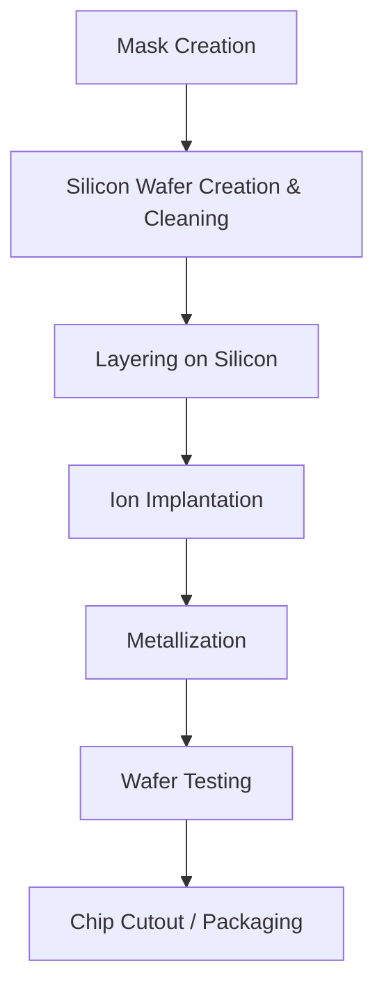
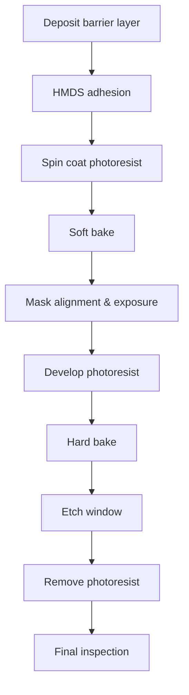
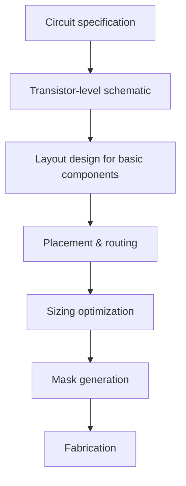
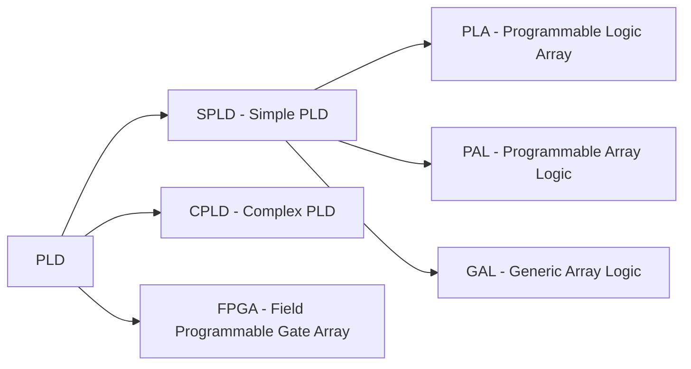

- **3 Hours**
- **8 Marks**
# 1 Introduction
## 1.1 Overview
- IC technology maps structural system representations to physical implementations.
- Three main methods:
	- Full-Custom (VLSI)
	- Semi-Custom (ASIC)
	- Programmable Logic Device (PLD)
## 1.2 CMOS Transistor Basics
- Terminals: Source, Drain, Gate
- Gate: poly-silicon, isolated by silicon diode $\large SiO_2$
- Operation (nMOS): High gate voltage -> attracts electrons -> forms conducting channel between source and drain.
## 1.3 Layers in Physical Implementation
|Layer|Purpose|
|---|---|
|Diffusion|Source & drain regions|
|Oxide ($SiO_2$)|Insulation|
|Polysilicon|Gate electrode|
|Metal layers|Interconnections (multiple layers possible)|
## 1.4 IC Manufacturing Process
### 1.4.1 Phase 1: Design Phase
1. Behavioral Description (HDL, RTL level)
2. Compilation -> gate-level netlist
3. Optimization (speed and area)
4. Physical Layout (place-and-route tools) -> placement of every transistor and wire
5. Mask Generation from layout
### 1.4.2 Phase 2: Manufacturing Phase
#### 1.4.2.1 Description

#### 1.4.2.2 Explanation
| Step                 | Description                                                          |
| -------------------- | -------------------------------------------------------------------- |
| **Mask Creation**    | Masks for each layer (oxide, metal, etc.)                            |
| **Wafer Creation**   | Czochralski process: melt Si, pull seed crystal, slice ingot         |
| **Cleaning**         | Piranha solution ($H_2SO_4 + H_2O_2$), megasonic, DI water rinse     |
| **Layering**         | Photolithography (see below)                                         |
| **Ion Implantation** | Doping: high-energy ions (KeV–MeV), then annealing to repair lattice |
| **Metallization**    | PVD or CVD for thin metal film & bonding pads                        |
| **Wafer Testing**    | Probes check output responses                                        |
| **Packaging**        | Through-hole (SIP, DIP) or surface mount; prevents damage/corrosion  |
## 1.5 Photolithography
### 1.5.1 Definition:
- Pattern transfer from mask to photoresist using UV light
- photo = light
- litho - stone
- graphy = writing
### 1.5.2 Importance
- enables complex circuit patterning on wafer
- critical for defining transistor geometries and interconnections
- determines minimum feature size and yield
### 1.5.3 Types of Photoresist
| Type     | Unexposed | Exposed to UV         |
| -------- | --------- | --------------------- |
| Positive | Insoluble | Soluble (washes away) |
| Negative | Soluble   | Insoluble (remains)   |
### 1.5.4 Ten Basic Steps of Photolithography
#### 1.5.4.1 Flowchart

#### 1.5.4.2 Detailed Steps
##### 1.5.4.2.1 Deposit Barrier Layer
- barrier layers are the materials which are required to be on substrate.
- *Materials*: silicon dioxide ($\large SiO_2$), silicon nitride, polysilicon, metals
- *Methods*: thermal oxidation, chemical vapor deposition (CVD), sputtering, vacuum evaporation
- $\large SiO_2$ as a barrier layer is used to isolate one layer from another.
	- e.g., used in electrical isolation of multilevel metallization
- grown via dry oxidation ($\large O_2$ gas) or wet oxidation (submerged in water)
- heat increases growth rate
##### 1.5.4.2.2 HMDS Coating
- Hexamethyldisilazane applied to surface
- improves adhesion of photoresist to water
##### 1.5.4.2.3 Photoresist Coating
- Photoresist = substance which changes its characteristics when exposed to UV light
- liquid photoresist is coated using spin coating method
	- Wafer held on vacuum chuck
	- Spun at 3-6000 rpm for 15-30 seconds
	- Liquid photoresist spreads evenly
- Thickness: few micrometers (depends on spin speed and resist viscosity)
##### 1.5.4.2.4 Soft baking (Pre-Bake)
- Process of heating wafer to remove solvents from photoresist
- Methods: hotplate, oven baking, microwave baking
- time and temperature vary by photoresist type
##### 1.5.4.2.5 Mask Alignment and Exposure
- mask aligned to wafer using stepers
	- Steppers = special device that use automatic pattern recognition and alignment system
	- Mask = opaque plate with holes/pattern to pass UV rays
- Controlled UV light exposes photoresist through mask pattern
- Positive photoresist: exposed area become soluble
- Negative photoresist: exposed area become insoluble
- 3 exposure methods:
	- **Contact Printing**: mask touches wafer -> high resolution, mask damage risk
	- **Proximity printing**: small gap -> less damage, lower resolution
	- **Projection printing**: image projected -> no damage, high resolution, step-and-repeat
##### 1.5.4.2.6 Develop Photoresist
- Soluble photoresist chemically washed away using developer solution
	- exposes barrier layer
- Method: immersion develop (wafer submerged in developer)
- rinsed with de-ionized (DI) water
- dried using spin dry method
##### 1.5.4.2.7 Hard Bake (Post Base)
- Stabilizes and hardens developed photoresist
- improves adhesion
- removes traces of solvent or developer solution
- warning: improper post-bake makes resist removal more difficult
- time and temperature vary by photoresist and baking method
##### 1.5.4.2.8 Etch Window in Barrier Layer
- Removes barrier layer not covered by hardened photoresist
- Wet etch (chemical etching): wafer submerged in HF acid 
- Dry etch (plasma etching): plasma collides with surface to remove material
##### 1.5.4.2.9 Remove Photoresist
- Strips remaining photoresist, exposing the required barrier layer
- methods:
	- *Solvent strippers*: resist swells and loses adhesion
	- *Resist ashing*: burning resist in oxygen plasma system
##### 1.5.4.2.10 Final Inspection
- Verify pattern fidelity
- Check for defects before next layer processing
#### 1.5.4.3 Diagrammatic Representation
![[Pasted image 20260422190834.png]]

---
# 2 Full-Custom (VLSI) IC Technology
## 2.1 Overview
- Definition
	- semiconductor design methodology
	- where every individual transistor and interconnect layer
	- is handcrafted, optimized, and tailored from scratch, 
	- rather than using pre-defined cell libraries.
## 2.2 Steps

1. Create layouts for basic components
2. Place components on IC (avoid overlap, minimize wire length)
3. Route connections between transistors
4. **Size** transistors & wires (wider = better performance but more power/area)
5. **Translate to masks** -> send to manufacturer
## 2.3 Physical Design Tasks
| Task          | Description                                        |
| ------------- | -------------------------------------------------- |
| **Placement** | Position & orient transistors; impacts wire length |
| **Routing**   | Connect wires between transistors                  |
| **Sizing**    | Transistor dimensions & wire widths                |
## 2.4 Merits & Demerits
| Merits                                          | Demerits                                               |
| ----------------------------------------------- | ------------------------------------------------------ |
| Excellent efficiency (power, performance, size) | High NRE cost                                          |
| No wasted area / unused transistors             | Very long time-to-market                               |
| Optimized layouts (compact, short wires)        | Design is time-consuming & error-prone (even with CAD) |
# 3 Semi-Custom (ASIC) IC Technology
## 3.1 Definition
- an Application-Specific Integrated Circuit (ASIC) design method that
- utilizes pre-designed, pre-tested, and pre-characterized logic cells 
- (such as gates, flip-flops, and multipliers) from a library 
- to construct a chip, 
- reducing design time and costs compared to full-custom approaches
## 3.2 Figure
![[Pasted image 20260422202144.png]]
## 3.3 Categories
### 3.3.1 Gate Array Semi-Custom
|Aspect|Description|
|---|---|
|**Pre-designed**|Masks for transistor & gate levels|
|**Designer does**|Connections between pre-designed gates|
|**Unused gates**|Many (fixed placement)|
|**Routing**|Long wires possible (placement unknown at design time)|
|**Time/cost**|Fast, inexpensive design cycles|
Simplified Layout: Array of pre-plced gates with routing channels.
![[Pasted image 20260422202211.png]]
### 3.3.2 Standard Cell Semi-Custom
| Aspect            | Description                                                                        |
| ----------------- | ---------------------------------------------------------------------------------- |
| **Pre-designed**  | Library of cells (NAND, NOR, mux, flip-flop) with known electrical characteristics |
| **Designer does** | Select cells, place & route                                                        |
| **Masks created** | After placement & routing (both cell & connection masks)                           |
| **Gate density**  | Very high                                                                          |
| **Performance**   | Good electrical performance                                                        |
- Simplified Layout: Rows of standard cells with routing over them
![[Pasted image 20260422202223.png]]
## 3.4 Merits and Demerits of Semi-Custom
| Merits                          | Demerits                                                |
| ------------------------------- | ------------------------------------------------------- |
| Lower NRE cost than full-custom | Lower performance (power, size, speed) than full-custom |
| Faster time-to-market           | Unused gates in gate array                              |
| Less design effort              | Fixed placement can cause long routing                  |
**Manufacturing** is same standard procedure
# 4 PLD IC Technology
## 4.1 Definition
- an integrated circuit (IC) containing 
- a vast, uncommitted array of 
	- logic gates (AND/OR) and
	- flip-flops 
- that can be configured by the user
- after manufacturing 
- to perform specific digital functions
## 4.2 Types

# 5 Comparison
## 5.1 PLA/PAL/CPLD

|Type|AND Array|OR Array|Characteristics|
|---|---|---|---|
|**PLA**|Programmable|Programmable|Most flexible, expensive|
|**PAL**|Programmable|Fixed|Smaller, faster, less expensive|
|**CPLD**|Multiple PLA/PAL blocks + programmable interconnect|High complexity, analog sense amplifiers possible (high current)||
## 5.2 Full-Custom/Semi-Custom/PLD

|Aspect|Full-Custom|Semi-Custom (ASIC)|PLD|
|---|---|---|---|
|**Design effort**|Very high|Medium|Low|
|**NRE cost**|Very high|Medium|Very low (none for chip itself)|
|**Time-to-market**|Long (months–years)|Medium (weeks–months)|Short (hours–days)|
|**Performance**|Best (optimized)|Good|Moderate|
|**Power efficiency**|Best|Good|Moderate|
|**Area utilization**|No waste|Some waste (gate array)|Significant waste|
|**Flexibility**|None (fixed mask)|None (fixed mask)|Reprogrammable|
|**Unit cost (high volume)**|Lowest|Low|High|
|**Prototyping**|Not feasible|Expensive|Ideal|
## 5.3 Steps in IC Manufacturing
|Step|Full-Custom|Semi-Custom|PLD|
|---|---|---|---|
|1|Transistor schematic|Select cells from library|Write HDL/programming file|
|2|Layout each transistor|Place & route cells|Compile/ synthesize|
|3|Verify DRC/LVS|Generate connection masks|Map to PLD architecture|
|4|Generate all masks|Fabricate (masks for cells + interconnects)|Program device (fuse/switch)|
|5|Fabricate|Test|Test & reprogram if needed|
|6|Test|—|—|
## 5.4 Parameter in IC Manufacturing
| Parameter            | Full-Custom | Gate Array | Standard Cell | PLD      |
| -------------------- | ----------- | ---------- | ------------- | -------- |
| Design time          | Very high   | Low        | Medium        | Very low |
| Performance          | Best        | Poor       | Good          | Moderate |
| NRE cost             | Highest     | Low        | Medium        | None     |
| Unit cost (high vol) | Lowest      | Low        | Low           | High     |
| Unused transistors   | None        | Many       | Few           | Many     |