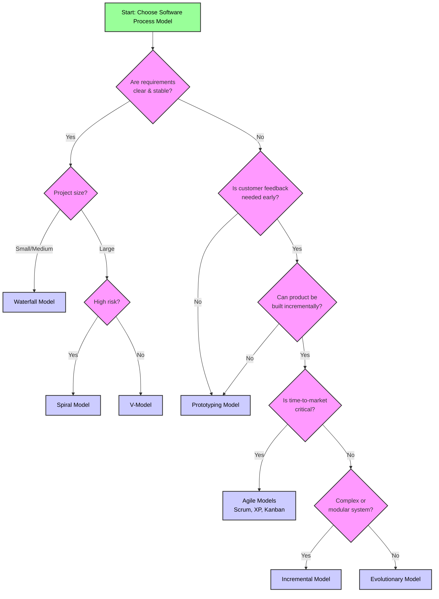

# 1.1 Introduction to Software Engineering
## 1.1.A Concept
### 1.A.i Software
- more than just program code
- **executable code** serving a computational purpose.
- consists of:
	- codes
	- libraries
	- documentations
- built for:
	- specific customer (**tailored**)
	- general market (**generic**)
### 1.A.ii Engineering
- developing **quality product**s using
	- scientific principles
	- standards **within budget and time**
### 1.A.iii Definition of SE
- Branch of CS focused on **quality software development** using well-defined methods.
- **Goal**: efficient, reliable, long term software
- used for **large systems**, not just single programs
- **aims** to improve: quality, budget, efficiency
- **Needed** because:
	- **Manages Complexity**:
		- provides structured methodologies (processes, models, tools) to build and maintain large, complex systems
	- **Ensures Quality and Reliability**:
		- Employs systematic analysis, design, testing and maintenance to produce dependable, efficient and bug-resistant software that meets user requirements.
	- **Controls Time and Cost**:
		- uses project management, planning, and estimation techniques to deliver software within budget and schedule constraints, avoiding cost overruns and delays.
	- **Facilitates Team Collaboration & Maintenance**:
		- Establishes clear documentation, standardized practices, and version control, enabling multiple developers to work cohesively and allowing for future updates and scaling.
---
## 1.1.B Types of Software
| S.N. | Type                          | Description                 | Examples                            |
| ---- | ----------------------------- | --------------------------- | ----------------------------------- |
| 1    | **Application**               | Software for End-Users      |                                     |
| 1.a  | -> **Generic** (Packaged)  | For large user groups       | MS-Word, Excel, Adobe Reader        |
| 1.b  | -> **Tailored **(Specific) | For specific user/org.      | Hospital, school, retail software   |
| 2    | **System** Software           | Controls hardware directly  | Drivers (video, audio), OS Kernels  |
| 3    | **Utility** Software          | Performs useful small tasks | WinZip, PDF merger, JPEG compressor |

---
---
# 1.2 Software processes and software process models
## 1.2.A Software Processes
- A **framework** of activities, actions, and tasks performed to create a software work product
- **not rigid**
	- adaptable to choose appropriate actions based on the project
- a **roadmap** for building software through predictable steps
- Goal is to ensure high-quality software

| S.N. | Feature1     | Feature2                                                             |
| ---- | ------------ | -------------------------------------------------------------------- |
| 1    | Apple        | Apple is a wet fruit that is wet. it is nice                         |
| 2    | Banana Shake | Banana is bananaing but what bananaing ajsndassdad laijiadisdaisd |
|      |              |                                                                      |
|      |              |                                                                      |

- Roles:
	- **Software engineers** perform the work
	- **Managers** manage/adapt the process
	- **Stakeholders** contribute to defining, building, and testing.
- **Importance**:
	- Provides structure, stability and control
### 2.A.i Software Development Life Cycle
- structured process to **design, develop, and test** high quality software
- **aims** to:
	- meet/exceed customer expectations
	- complete within time and budget
- A **framework** defining tasks at each development stage
- provides a plan for developing, maintaining and enhancing software
- **Goal**:
	- to improve software quality and development efficiency.
- the following figure is a graphical representation of the various stages of a typical SDLC.
  ![[sdlc.png | 500]]
### 2.A.ii Typical stages
1. **Planning and Requirement Analysis**
	- **Most Critical Stage**
	- Inputs: Customer, sales, market surveys, domain experts
	- Outputs: project approach, feasibility study (economical, operational, technical)
	- Also includes: quality assurance planning, risk identification
2. **Defining Requirements**
	- Document Requirements in **Software Requirement Specification** (SRS)
	- Get approval from customer/market analysts.
3. **Designing the Product Architecture**
	- Use SRS to create architecture
	- Produce **Design Document Specification** (DDS) with:
		- multiple design approaches
		- System Components, data flow, UI mock-ups, integration points
	- Review DDS with stakeholds
	- Select best design based on:
		- risk, robustness, modularity, budget, time
	- DDS includes: architectural diagrams, module specs, data models, tech stack
4. **Building or Developing the Product**
	- actual coding begins
	- Follow DDS and organizational coding guidelines
	- Use tools: Compilers, Debuggers, Interpreters
	- Languages: C, C++, Java, PHP, etc high level language, chosen per software type
5. **Testing the Product**
	- Testing occurs in all stages, but this phase is dedicated to detect tracking and fixing.
	- Repeat until product meets SRS quality standards
6. **Deployment in the Market and Maintenance**
	- Release product to market (may be staged)
	- **User Acceptance Testing** (UAT) in real environment
	- Gather feedback -> enhance if needed.
	- Post-release: maintenance for existing customers.
---
## 1.2.B Software Process Model
- A methodology to organize and execute SDLC phases
- divides work into distinct phases for better design, management, and control.
- provides guidelines for carrying out SDLC stages
### 2.B.i Factors in choosing software model
| S.N. | Factor                     | Consideration                                              |
| ---- | -------------------------- | ---------------------------------------------------------- |
| 1.   | **Project Requirements**   | Clarity, stability, need for iterative clarification       |
| 2.   | **Project Size**           | Larger projects need more detailed planning and structure  |
| 3.   | **Project Complexity**     | Unclear/changing requirements may require flexible models. |
| 4.   | **Cost of Delay**          | Time sensitivity vs. Flexible timelines                    |
| 5.   | **Customer Involvement**   | Level of ongoing stakeholder participation                 |
| 6.   | **Familiarity with Techn** | Team's expertise with domain, tools, language              |
| 7.   | **Project Resources**      | Availability of funds, staff and other resources           |

---
## 1.2.C Types of Software Process Models (SPM)
At the end of this, at 1.2.D, comparison table for short references
### 2.C.i Waterfall Model
#### C.i.a Concept
- **first SPM**, linear-sequential approach
- **simple**, easy to understand
- **Phases must complete sequentially**, no overlap.
- Output of one phase = input to next.
#### C.i.b Figure
![[Pasted image 20260207101311.png]]
#### C.i.c Phases
1. **Requirement Analysis**
	- Requirement Specifications are developed and documented in **Requirement Specification Document** (RDS).
	- Understand what the system should do
2. **System Design**:
	- RDS is studied and design is started to specify hardware and system requirements.
	- help in defining overall system architecture
	- Prepare **System Design Documents** (architecutre, UML, Database schema)
3. **Implementation**
	- System is developed with small programs called units
		- that are built independently, and tested for its functionality
		- each unit test is called Unit Testing
	- Get executable program modules
4. **(Integration &) Testing**
	- get a fully working system after integrating and testing of units
	- system itself is tested for fault
5. **Deployment**
	- has to be tested fully by now
	- product is deployed/released to market
6. **Maintenance**
	- to fix potential issues, patches are released.
	- also to enhance the product, some better versions are released.
	- have a stable system for customers with bug fixes and enhancements.
#### C.i.d When to Use
- **Requirements: clear, fixed**, well-documented
- Technology is **stable & understood**
- **Short projects** with ample resources
#### C.i.e Adv/Disadv
| S.N. | Adv                                     | Disadv                                                    |
| ---- | --------------------------------------- | --------------------------------------------------------- |
| 1    | Simple and easy to understand & use     | no revision/reflection during phases                      |
| 2    | clear milestones & documentation        | no working software until end                             |
| 3    | works for small, well-defined projects  | High risk & uncertainty                                   |
| 4    | Easy task arrangement                   | not suitable for changing requirements                    |
| 5    | well-defined stages                     | Poor for long, complex, OOP projects                      |
| 6    | well understood milestones              | not a good model for complex and object-oriented projects |
### 2.C.ii. V model
#### C.ii.a Concept
- extension of waterfall
	- that emphasizes verification and validation
- development phase <-> testing phase planned in parallel
- V-shape: Left side = development, right side = testing
- Verification:
	- static review without executing code
		- that evaluates the product development to build right products
- Validation:
	- dynamic testing by executing code
		- that evaluates the software after developing system to 
		- determine if customer expectations are met.
		- and right products are built.
#### C.ii.b Figure
![[Pasted image 20260207103157.png]]
#### C.ii.c Phases
1. **Requirement Analysis**
	- Gathering requirement from customer to understand their requirements and expectations
2. **System Design**:
	- contains the system design and the complete hardware and communication setup for developing the product
	- system test plan is developed based on the system design
3. **Architectural Design**
	- plan modules with individual functionalities and
		- make data transfer and communication between modules
		- describe dependency, architecture diagram, technology for each module
	- integrated testing is planned
4. **Module Design**
	- system breaks down into small modules are designed, which is aka Low-Level Design (LLD).
5. **Testing Phases**
	1. Unit Testing:
		- unit test plans are developed during module design phase.
		- these unit test plans are executed to eliminate bugs at code or unit level
		- these unit test plans are executed to eliminate bugs at code or unit level.
	2. Integration Testing:
		- the modules are integrated and the system is tested
		- performed on the architecture design phase
		- verifies the communication of modules among themselves
		- done after completion of unit testing.
	3. System Testing:
		- test the complete application with its functionality, inter dependency and communication
		- tests the functional and non-functional requirements of the developed application.
	4. User Acceptance Testing:
		- UAT is performed in a user environment that resembles the production environment.
		- UAT verifies that the delivered system meets user's requirement and system is ready for use in real world.
#### C.ii.d When to Use:
- requirements clearly defined & fixed
- high discipline and early defect detection needed.
- small to medium projects.
#### C.ii.e Adv/Disadv
| S.N. | Adv                                                     | Disadv                             |
| ---- | ------------------------------------------------------- | ---------------------------------- |
| 1    | disciplined, easy to manage                             | high risk & uncertainty            |
| 2    | early verification/validation                           | not good for OOP/Complex projects  |
| 3    | error-free, high-quality product                        | no iteration between phases        |
| 4    | Good progress tracking                                  | unstable for changing requirements |

---
### 2.C.iii Incremental Model
#### C.ii.a Concept
- requirements divided into standalone modules
- each module goes through full cycle:
	- Requirement -> Design -> Code -> Test
- working software early in life cycle
- subsequent releases add functionality incrementally.
#### C.ii.b Figure
![[Pasted image 20260207110456.png]]
#### C.ii.c When to Use:
- long development schedules
- customer needs early release of core features
- teams not highly skilled
- easier to manage per module
#### C.ii.d Adv/Disadv
| SN  | Adv                                       | Disadv                                  |
| --- | ----------------------------------------- | --------------------------------------- |
| 1   | early working software                    | needs good planning                     |
| 2   | easy to test and debug per module         | Higher total cost                       |
| 3   | flexible, risk handled per iteration      | requires well-defined module interfaces |
| 4   | client gets functionality early           |                                         |

---
### 2.C.iv RAD Model
#### C.ii.a Concept
- Rapid Application Development
- High-speed linear sequential model
- project is broken into small, independent modules
- each module: Analyze -> Design -> Code -> Test
- Time-boxed delivery i.e. fast delivery, of 60-90 days per module.
#### C.ii.b Figure
![[Pasted image 20260207111321.png]]
#### C.ii.c Phases
1. **Business Modelling**
	- define flow of information within the organization, so that it covers all functions
	- clarify nature, type, source, process of information.
2. **Data Modelling**
	- convert the component of the information flow into a set of data objects, referred to as entities.
3. **Process Modelling**
	- entities are used to depict the flow of information (adding, deleting, modifying and retrieving)
4. **Application Designing**
	- code generation using 4th General Language
5. **Testing**
	- test the new program component.
#### C.ii.d When to Use
- Requirements well-known, user involved thorughout
- Modularizable system with reusable component
- Short development timeframe
- Skilled teams & automated tools available
#### C.ii.e Adv/Disadv
| S.N. | Adv                                  | Disadv                                                                                                   |
| ---- | ------------------------------------ | -------------------------------------------------------------------------------------------------------- |
| 1    | fast delivery of functional software | requires highly skilled professionals                                                                    |
| 2.   | encourages reusable components       | can fail if reusable components are absent                                                               |
| 3.   | Reduced cycle time with reuse        | not suitable for non-modular systems                                                                     |
| 4.   |                                      | Not for high technical risk projects.                                                                    |
| 5.   |                                      | Not for large projects (needs many teams)                                                                |

---
### 2.C.v Evolutionary Process Model
#### C.ii.a Concept
- also called successive versions model
- combines iterative + incremental approaches
- initial requirements & architecture defined upfront, then evolved through feedback.
- Delivers working versions incrementally over time
- each cycle ends with a user-accessible product; feedback shapes next iteration.
#### C.ii.b Figure
![[Pasted image 20260207113002.png]]
#### C.ii.d When to Use
- Large projects with modular, incrementally deliverable components
- Customer wants core features early (not full software at once)
- requirements may evolve based on feedback
- Object-Oriented systems (easily partitioned into objects)
- New technology being learned during development
#### C.ii.e Adv/Disadv
| S.N. | Adv                                         | Diasdv                                                        |
| ---- | ------------------------------------------- | ------------------------------------------------------------- |
| 1    | early user access & feedback                | hard to partition system into acceptable deliverable versions |
| 2    | Core modules thoroughly tested              | Requires continuous customer involvement                      |
| 3    | Reduces errors through iterative refinement | High time investment                                          |
### 2.C.vi Iterative Model
#### C.ii.a Concept
- iterative process starts with a simple implementation of a small subset of requirements
- enhances versions iteratively until full system is ready
- repeated cycles (iterations) each produce a new version
- Agile and Scrum are based on iterative + iterative principles.
#### C.ii.b Figure
![[Pasted image 20260207114712.png]]
#### C.ii.c When to Use
- major requirements clear, but details may evolve
- time to market constraint exists
- new technology being adopted by the team
- contract-based skilled resources per iteration.
#### C.ii.e Adv/Disadv
| S.N. | Adv                                            | Disadv                                          |
| ---- | ---------------------------------------------- | ----------------------------------------------- |
| 1    | Early working functionality                    | requires more resources                         |
| 2    | Progress measurable early & periodically       | not ideal for highly changing requirements      |
| 3    | Lower cost of scope changes                    | design issues may arise due to evolving specs   |
| 4    | Easier testing & deubgging per iteration       | not suitable for smaller projcets               |
| 5    | Risk identification & resolution per iteration | high management complexity                      |
| 6    | High-risk parts tackled first                  | project end-date uncertain                      |
| 7    | risk-driven, manageable milestones             | highly skilled team needed for risk analysis    |
| 8    |                                                | progress depends heavily on risk analysis phase |
### 2.C.vii. Spiral Model
#### C.ii.a Concept
- important SDLC
- provides risk handling
- risk-driven iterative model combining prototyping + systematic waterfall
- spiral loops = phases
- number varies per project based on risks.
- each loop represents progress (angular) & cost (radius)
- first loop: product specification
- later loops: prototypes transitioning to final versions
- risk handling via prototyping at each phase.
#### C.ii.b Figure
![[Pasted image 20260207115519.png]]
#### C.ii.c Phases per loop
1. Planning: Define objectives, alternatives, constraints
2. Risk Analysis: Identify & Resolve risks
3. Engineering: Develop & test product
4. Evaluation: Review, plan next iteration
or
- Communication: talk/consult with customer/stakeholder
- planning: define objectives, alternatives, constraints
- model: prepare datatypes, schema, etc for a feature
- construction: prepare prototypes for the model
- deployment: release new feature to customer base
#### C.ii.d When to use
- large, high-risk projects.
- requirements unclear or evolving
- long-term projects needing continuous risk assessment
- customer feedback integrated regularly.
#### C.ii.e Adv/Disadv
| S.N. | Adv                          | Disadv                               |
| ---- | ---------------------------- | ------------------------------------ |
| 1    | Risk handling built-in       | complex to manage                    |
| 2    | good for large projects      | expensive (prototyping and analysis) |
| 3    | flexibility requirements     | over-dependence on risk analysis     |
| 4    | higher customer satisfaction | difficult time management            |
### 2.C.viii. Prototype Model
#### C.ii.a Concept
- prototype = working replica of the product developed early in the life cycle
- used when requirements are unclear or unstable
- allows early customer feedback to refine the product iteratively.
- Process:
	1. Interview customer -> develop high-level paper model.
	2. Build initial prototype with basic functionality.
	3. Test -> gather feedback -> refine
	4. Repeat until customer approves
#### C.ii.b Types
| Type                | Description                                                                            | Use Cases                                  |
| ------------------- | -------------------------------------------------------------------------------------- | ------------------------------------------ |
| **Rapid Throwaway** | quick, disposable prototypes to explore ideas                                          | Early feedback, idea validation            |
| **Evolutionary**    | Prototype incrementally refined into final product                                     | Saves time; avoids rebuilding from scratch |
| **Incremental**     | Product broken into pieces; each prototyped separately and then merged              | Complex systems; parallel development.     |
| **Extreme**         | 3-phase for web development: static HTML -> simulated services -> final integration | Web applications; fast, focused delivery   |
#### C.ii.b Figure
![[Pasted image 20260207180256.png]]
#### C.ii.c When to Use
- unclear or changing requirements
- user interfaces, high-tech systems, complex algorithms
- to demonstrate technical feasibility.
- when customer involvement is high.
#### C.ii.e Adv/Disadv
| S.N. | Adv                                                   | Diasdv                                          |
| ---- | ----------------------------------------------------- | ----------------------------------------------- |
| 1    | early visibility of product -> customer satisfaction  | frequent requirement changes                    |
| 2    | easy accommodation of new requirements                | costly in time & money                          |
| 3    | early error detection -> cost & effort could be saved | poor documentation due to changes               |
| 4    | missing features identified early                     | developer stress to accommodate changes         |
| 5    | reusable prototypes for future projects.              | uncertain iteration counts                      |
| 6    |                                                       | customer may demand early delivery              |
| 7    |                                                       | risk of suboptimal solutions (rush job)         |
| 8    |                                                       | customer may lose interest if prototype is poor |

---
## 1.2.D Comparison/Reference Table
| Model            | Concept                                      | How It’s Developed                                               | Key Point 1                           | Key Point 2                              | Major Strength                         | Major Weakness                          | Best For                                        |
| ---------------- | -------------------------------------------- | ---------------------------------------------------------------- | ------------------------------------- | ---------------------------------------- | -------------------------------------- | --------------------------------------- | ----------------------------------------------- |
| **Waterfall**    | Linear, sequential phases                    | One phase completes before next starts                           | Rigid, no overlap                     | Clear milestones & docs                  | Simple, easy to manage                 | No working software until late          | Small, stable requirement projects              |
| **V-Model**      | Extension of Waterfall with parallel testing | Each dev phase has corresponding test phase                      | Verification & validation emphasized  | Early defect detection                   | High discipline, quality focus         | Inflexible, no iteration                | Medium projects with fixed requirements         |
| **Incremental**  | Divide requirements into standalone modules  | Multiple cycles; each module = mini-waterfall                    | Early working software                | Modules developed & tested independently | Early delivery of core features        | Needs good planning & interface design  | Long projects, early release needed             |
| **RAD**          | Rapid, modular, time-boxed development       | Parallel teams develop modules; uses reuse & 4GL                 | Fast delivery (60–90 days)            | Heavy reuse of components                | Quick turnaround, customer involvement | Requires skilled team & tools           | Modular projects with reusable components       |
| **Evolutionary** | Iterative + incremental; successive versions | Initial spec → versions evolve with feedback                     | User feedback drives evolution        | Core modules tested early                | User gets early access & feedback      | Hard to partition into versions         | Large, OO projects; evolving requirements       |
| **Iterative**    | Start simple, enhance through cycles         | Repeated cycles produce refined versions                         | Risk handled per iteration            | Progress measurable early                | Risk management, early functionality   | High management complexity              | Projects with unclear details, new tech         |
| **Spiral**       | Risk-driven, iterative + prototyping         | Loops = phases; each has planning, risk, engineering, evaluation | Risk analysis central                 | Prototypes at each phase                 | Excellent risk handling                | Complex, expensive, time unpredictable  | Large, high-risk, unclear requirements          |
| **Prototyping**  | Build working replica early for feedback     | Prototype → feedback → refine until accepted                     | Requirements clarified via prototypes | Early customer involvement               | Early visibility, error detection      | Costly, poor documentation, scope creep | Unclear/changing requirements; UI-heavy systems |

---
## 1.2.E Flowchart for Choosing SPM:

---
---
# 1.3 Agile Software Developments
## 1.3.A Concept
- Agile = swift, versatile, adaptive
- Iterative development approach with short cycles (1-4 Weeks)
- Breaks project into small increments.
- Scope & requirements defined early but adaptable
- Each iteration includes full SDLC phases
- Goal: 
	- Minimize risk, 
	- reduce delivery time, 
	- deliver working software frequently
## 1.3.B Phases

| S.N. | Phase                         | Description                                                      |
| ---- | ----------------------------- | ---------------------------------------------------------------- |
| 1.   | **Requirement Gathering**     | Identify business needs, feasibility study (technical/economics) |
| 2    | **Design the Requirements**   | Collaborate with stakeholders, use diagrams (UML, user flows)    |
| 3    | **Construction/Iteration**    | Developers build minimal viable product (MVP)                    |
| 4    | **Testing/Quality Assurance** | Continuous testing, bug fixing, performance checks               |
| 5    | **Deployment**                | Release product to user environment                              |
| 6    | **Feedback**                  | Gather use feedback -> incorporate in next iteration             |
## 1.3.C Origins
- Agile Manifesto (2001) by Kent Beck and others
- Four core values:
	- individuals & interactions > processes & tools
	- Working software > comprehensive documentation
	- Customer collaboration > contract negotiation
	- Responding to change > following a plan
- Incremental delivery with frequent releases.
- Best for changing requirements, time-critical apps
- Examples: Scrum, XP, Crystal, FDD, Kanban.
## 1.3.D Principles of Agile methods
1. **Customer involvement**
	- customer should be involved in development process
		- to provide and prioritize new system requirements and 
		- to evaluate the iteration of the system
2. **Incremental delivery**:
	- customer specify requirement of each increment
	- software developed according to this requirement
3. **People not process**:
	- recognize development team's skills
	- avoid rigid process and no exploitation of team members
4. **Embrace change**
	- expect the system requirements to change
	- so design the system to accommodate these changes
5. **Maintain simplicity**
	- focus on simplicity in developing software and in development process wherever possible
	- work to eliminate complexity from the system.
## 1.3.E Adv/Disadv
| S.N. | Adv                             | Disadv                             |
| ---- | ------------------------------- | ---------------------------------- |
| 1    | high stake holder Engagement    | less predictable timelines         |
| 2    | Transparency & early delivery   | more time and commitment           |
| 3    | predictable costs & schedule    | higher demands on devs and clients |
| 4    | adaptable to change             | lack of necessary documentation    |
| 5    | focus on business value & users | projects can easily derail         |
| 6    | improves quality                |                                    |

---
---
# 1.4 Requirements Engineering processes
- Requirements Engineering (RE):
	- systematic process of identifying, documenting, and managing software requirements
	- Transforms real-world problems into clear, actionable software specifications.
- Requirements Management (RM):
	- subset of RE
	- focuses on tracking and controlling changes.
## 1.4.A Steps for RE
|     | Step                          | Description                                                 | Key Activities                                                                          |
| --- | ----------------------------- | ----------------------------------------------------------- | --------------------------------------------------------------------------------------- |
| 1   | **Elicit Requirements**       | Understand the problem and gather stakeholder needs         | Interviews, workshops, observation, background research                                 |
| 2   | **Requirement Specification** | Document functional and non-functional requirements clearly | use DFD, UML, SRS, user stories                                                         |
| 3   | **Verification & Validation** | Ensure requirements are correct and meet real needs         | Verification: are we building it right? Validation: Are we building the right thing? |
| 4   | **Requirement Management**    | Ongoing tracking, prioritization, and change handling       | Traceability matrices, version control, stakeholder communication                       |
## 1.4.B Why RE is important?
-  avoid pitfalls like scope creep, miscommunication, rework
- serves as a compass for development, ensuring alignment with business goals.
- keep all stakeholders on the same page regarding deliverables and expectations
- reduces risk by clarifying what needs to be built before development begins.
## 1.4.C Why Identify Requirements?
|     | Reason                                | Explanation                                                                        |
| --- | ------------------------------------- | ---------------------------------------------------------------------------------- |
| 1   | **Defines Objects & Classes**         | Requirements help identify real-world entities -> map to classes/objects           |
| 2   | **Supports Encapsulation**            | clear requirements define what data/methods belong together in a class             |
| 3   | **Guides Inheritance & Polymorphism** | requirements highlight commonalities -> promote reuse via inheritance              |
| 4   | **Ensures Use Case Accuracy**         | OOSE relies on use cases; accurate requirements ensure correct use case modeling   |
| 5   | **Reduces Representational Gap**      | good requirements bridge the gap between real world problems and software models.  |
| 6   | **Facilitates Iterative Development**     | in iterative models like agile, requirements evolve -> objects adapt incrementally |
| 7   | **Improves Testability**                  | Clear requirements -> clear test cases for unit, integration, and system testing   |

---
---
# 1.5 System modeling
## 1.5.A Concept
- process of creating abstract graphical representations of a system using notations like UML
- Each model shows a different perspective of the system
- Used to 
	- understand functionality
	- communicate with stakeholders
	- guide design & implementation
## 1.5.B Perspectives
| Perspective | What it Shows                                                     | UML Diagrams Often Used                             |
| ----------- | ----------------------------------------------------------------- | --------------------------------------------------- |
| External    | System context & environment                                      | Use Case Diagrams                                   |
| Interaction | Interactions between system & environment, or internal components | Sequence Diagrams, Communication Diagrams           |
| Structural  | Organization of system components or data structures              | Class Diagrams, Object Diagrams, Component Diagrams |
| Behavioral  | Dynamic behavior & response to events                             | State Diagrams, Activity Diagrams                   |
## 1.5.C Useful UML Diagrams for System Modeling
| Diagram          | Purpose                                                                  | Used For                             |
| ---------------- | ------------------------------------------------------------------------ | ------------------------------------ |
| Use Case Diagram | Shows interactions between system and external actors                    | Capturing functional requirements    |
| Class Diagram    | Shows object classes and their relationships (associations, inheritance) | Structural design, data modeling     |
| Sequence Diagram | Shows time-ordered interactions between objects/actors                   | Dynamic behavior, process flows      |
| Activity Diagram | Shows workflow or process steps                                          | Business processes, algorithms       |
| State Diagram    | Shows how system responds to internal/external events                    | Real-time systems, stateful behavior |
## 1.5.D Why Model Both existing and new systems?
1. Existing System:
	- understand current functionality, 
	- identify strengths/weaknesses,
	- derive requirements for new system
2. New System
	- Explain proposed requirements,
	- discuss design
	- document for implementation
	- validate with stakeholders
## 1.5.E Why Need Different System Models
|Reason|Explanation|
|---|---|
|**Different Stakeholders, Different Views**|Managers, developers, testers, and customers need different levels of abstraction.|
|**Complexity Management**|Breaking down system into views (structural, behavioral, etc.) reduces cognitive load.|
|**Complete Understanding**|No single model can capture all aspects (static structure, dynamic behavior, interactions).|
|**Error Reduction**|Multiple models allow cross-validation, catching inconsistencies early.|
|**Communication Clarity**|Visual models improve communication and reduce ambiguity compared to textual descriptions.|
|**Design Validation**|Models allow simulation and analysis before implementation, saving time and cost.|
|**Traceability**|Models link requirements to design to code, supporting maintenance and changes.|

---
---
# 1.6 Software prototyping
- prototype is a working model of software with some limited functionality
- the prototype does not always hold the exact logic used in the actual software application and is an extra effort to be considered under effort estiamtion
- prototyping is used to allow the users evaluate developer proposals and try them out before implementation
- it also helps understand the requirements which are user specific and may not have been considered by the developer during product design.
---
---
# 1.7 Object Oriented Software Development
- in software there are severa way to approach a model.
- the 2 most common ways are from an algorithmic persepctive and from an object oriented perspective
- traditional view of software development takes an algorithmic persepctive
	- in this approach the main building block of all software is the procedure or fucntion
	- as the requirement change and the system grows system built with an algorithmic focus turn out to be very hard to maintain
- in object oriented approach,
	- the main building block of all software systems is the object or class.
	- An object is a thing generally drawn from the vocabulary of the problem space or the solution space, a class is a description of a set of common objects.
	- every object has identity, state and behavior.
	- for example:
		- consider a simple 3-tier architecture for a billing system, involving user interface, middleware and a database.
		- in the user interface, you will find concrete objects such as tables representing entities from the problem domain, including customers, products and orders.
		- in the middle layer you will find objects such as transaction and business rules, as well as higher level views of problem entities, such as customer, products and orders.
	- the object-oriented approach to software development is decidedly a part of the mainstream simply because it has proved to be of value in building system in all sorts of problem domains and encompasses all degree of size and complexity.
	- most contemporary languages operating systems and tools are object oriented in some fashion giving greater the world in terms of objects.
## 1.7.A SRS Document
- generated as output of requirement analysis
- SRS should be consistent, correct and complete document
- SRS contains functional and non-functional requirements only, it does not offer design suggestions, possible to technology or business issues or any other information
### 1.7.A.i Problems without SRS Document
- important problem if no SRS Document:
	- the system would not be implemented according to customer needs
	- software developers would not know whether what they are developing is what exactly required by the customer
	- without SRS document, it will be very much difficult for the maintenance engineers to understand the functionality of the system
### 1.7.A.ii Goals of SRS Document
1. Feedback to customer: 
	- provides the feedback to the customer
2. Problem Decomposition:
	- SRS document decomposes the problem into component parts.
	- the simple act of writing down software requirements in a well designed format that helps break down the problem into its component parts in an orderly fashion
3. input to design specification: 
	- SRS document must contain sufficient detail in the functional system requirements so that a design solution can be devised
### 1.7.A.iii properties of a Good SRS document
1. Concise: should be consistent and complete
2. Structured: A well-structured document is easy to understand and modify.
3. Black box view: it should only specify what the system should do and refrain from stating how to do these
4. verifiable: it should be possible to determine whether or not requirements have been met in an implementaiton.
### 1.7.A.iv Characteristics of an SRS Document
1. **Correctness**:
	- SRS is correct if every requirements included in the SRS represents something required in the final system
2. **Completeness**:
	- SRS is complete when it is documented after:
		- the involvement of all types of concerned personnel
		- focusing on all problem, goals, and objectives and not only on functions and features
3. **Unambiguous**:
	- must be clear
4. **Verifiable**:
	- is verifiable if and only if there exists some cost effective process that can check whether the final product meets the reuqirement
5. **Modifiable:
	- is modifiable if its structure and style such that any necessary change can be made easily while preserving completeness and consistency
6. **Consistency**:
	- consistency is necessary to achieve correct results across the system, done by:
		- use of standard tersma nd definitions
		- consistent application of business rules in all functionality
7. **Testability**:
	- should be written in such a way that it is possible to create a test plan to confirm whether specifications can be met and requirements can be delivered
8. **Clarity**:
	- should be clear
## 1.7.B Functional  & Non-functional Requirements
| Aspect            | Functional Requirements                            | Non-Functional Requirements                                 |
| ----------------- | -------------------------------------------------- | ----------------------------------------------------------- |
| **Definition**    | Describe **what** the system should do             | Describe **how well** the system should perform             |
| **Focus**         | System functionality, features, behavior           | System quality, performance, constraints                    |
| **Measurability** | Usually binary (implemented/not implemented)       | Measurable metrics (speed, availability, etc.)              |
| **Example**       | “User should be able to login with email/password” | “System should respond within 2 seconds”                    |
| **Derived From**  | Direct user needs, business rules                  | User expectations, technical constraints                    |
| **Testability**   | Verified through functional testing                | Verified through performance/load testing                   |
| **Priority**      | Often higher in early stages                       | Critical for user satisfaction & scalability                |
| **Documentation** | Use cases, user stories, SRS                       | Quality attributes, SLAs, constraints in SRS                |
| **Example**       | The system shall allow users to reset passwords    | the password reset process shall complete within 5 seconds. |
## 1.7.C Walking on water and developing software
> Walking on water and developing software from specification are easy if both
are frozen
- main point is about impracticality of rigid unchanging requirements in software development
- **Frozen Specifications** imply that requirements never change—unrealistic in real-world projects.
- **Water Frozen** = stable surface → easy to walk on.
- **Specifications Frozen** = fixed, unchanging requirements → theoretically easier to build from.
- **Reality**: Requirements **evolve** due to market changes, user feedback, new insights.
- **Implication**: Agile/iterative approaches are needed because **change is inevitable**.
- **Lesson**: Rather than resisting change, process models should **embrace flexibility** (e.g., Agile, Spiral, Evolutionary models).