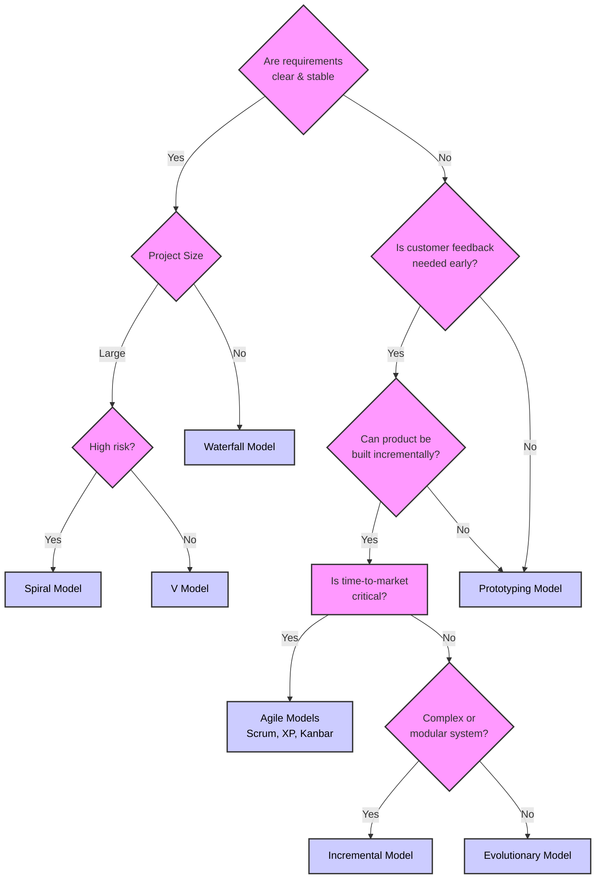

# 1 Chapter
## 1.1 SDLC
PDD-BTD
- Planning
- Defining
- Designing

- Building
- Testing
- Deployment
### 1.1.1 Waterfall
RSI-TDM
- Requirement Analysis
- System Design
- Implementation

- Testing
- Deployment
- Maintenance
### 1.1.2 V model
RSAM - C - UISA
- Requirement Analysis
- System Design
- Architecture Design
- Module Design

- Code

- Unit Testing
- Integration Testing
- System Testing
- Acceptance Testing
### 1.1.3 Incremental
RDCT
- Requirement Analysis
- Design
- Code
- Test

### 1.1.4 RAD
EM - ADCT - IT
- Elicit requirements
- Modularize Requirements

- Analyze, Design, Code, Test

- Integrate
- Test the final product

### 1.1.5 Evolutionary
SPD - DDEI - D
- Software concept
- preliminary requirement analysis
- design of architecture and system core

- Develop a version
- Deliver the verison
- Elicit Customer Feedback
- Integrate Customer Feedback

- Deliver final version
### 1.1.6 Iterative
RADTIR - DTIR - DTIRDM
- Requirement
- Analysis
- Design
- Test
- Implement
- Review

- Design
- Test
- Implement
- Review

- Design
- test
- Implement
- Review
- Deployment
- Maintenance

### 1.1.7 Spiral
CPM-CD
- Communication
- Planning
- Modeling

- Construction
- Deployment
### 1.1.8 Prototype
CDT
- Customer feedback
- develop/refine prototype
- testing of prototype
#### 1.1.8.1 Types
EERI
- Evolutionary
- Extreme
- Rapid Throwaway
- Incremental
## 1.2 Choosing SPM

## 1.3 Agile
### 1.3.1 Phases
RD,CT,DF
Road katera defence
- Requirement Gathering
- Design the requirements
- Construction/Iteration
- Testing/quality assurance
- deployment
- feedback
### 1.3.2 Values
- individuals & interactions > processes & tools
- customer collaboration ` `> contract negotation
- working software `      ` > comprehensive documentation 
- responding to change `  ` > following a plan
### 1.3.3 Principles
CID-PNP-ECMS
- Customer involvement
- Incremental delivery
- People not process
- Embrace Change
- Maintain simplicity
## 1.4 Requirement engineering process
### 1.4.1 Steps
ERVR
- Elicit requirements
- requirement specification
- verification and validation
- requirement management
# 2 Chapter
## 2.1 Polymorphism Types
C-R
- Compilation Time
	- function overloading
	- operator overloading
- Run Time
	- virtual function
	- pointer
## 2.2 Transformation in OOD
ADI
- Analysis
- Design
- Implementation
## 2.3 Categories of Object
OREO-TPS
oreo tp's
- Occurences/Events
	- sensor event, transaction
- Roles
	- manger, homeowner, operator
- External Entities
	- sensor, user, other systems
- Organization Units
	- division, monitoring service
- Things
	- Alarm, receipt, status display
- Places
	- Manufacturing floor, loading dock
- Structure
	- four-wheel vehicle, sensor array
## 2.4 Selection Criteria
RIMACA ERNS
- retailed information
- Multiple Attribute
- Common Attributee

- Essential Requirement
- Needed Services
---
---
# 3 Chapter
---
---
# 4 Chapter
## 4.1 Iterative development process
PR-AD-I-T-ER
- Planning & Requirement
- Analysis & design
- Implementation
- Testing
- Evaluation & Review
## 4.2 Phases
IECT
- Inception
- Elaboration
- Construction
- Transition
## 4.3 UP Disciplines
BMDe-CnC-En Re-De-Im PM-Te
- Business Modeling
- Design
- Config and Change management
- Environment

- Requirements
- Deployment
- Implementation

- Project Management
- Testing
# 5 Chapter
## 5.1 Booch Method
### 5.1.1 Diagrams
DI
COSI, MP
Design Level
- Class
- Object
- State Transition
- Interaction
Implementation Level
- Module diagram
- process diagram
## 5.2 Coad-Yourdon Method
### 5.2.1 SOSAS Steps
- Subject
- Object
- Structure
- Attribute
- Service
### 5.2.2 Components
PHTD
- Problem domain
- Human interaction
- Task maangement
- data management
### 5.2.3 General compoents
SDIA
- static/structural
- dynamic/behavioral
- interaction/use case
- architectural
## 5.3 Layers in design model
S-CO-M-R
Subsystem layer
class and object layer
message layer
responsibliities layer 