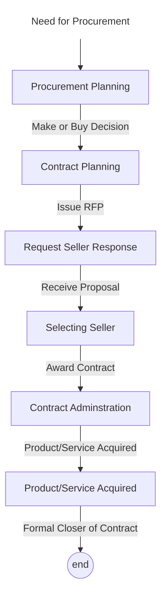

- **3 Hours**
- **5 Marks**
# Project Procurement
- The term "procurement" refers to buying goods and/or services from a third party.
- it's a group of processes required to purchase the products, services, goods or results needed from outside of the project team to perform the work
- most organizations do some form of outsourcing to meet their IT needs and spend most money within their own country
- organizations or individuals who provide procurement services are referred to as suppliers, vendors, contractors, subcontractors, or sellers
- suppliers are the most widely used
# Project Procurement Management
- PPM includes the processes required to acquire goods and services for a project from outside the performing organization.
- Organizations can be either the buyer or the seller of products or services under a contract or other agreement
## Procurement Process
| S.N. | Process                               | Description                                                                                                      |
| ---- | ------------------------------------- | ---------------------------------------------------------------------------------------------------------------- |
| 1    | Planning purchases and acquisition | decide what to buy, when to buy it, and how                                                                      |
| 2    | Planning Contracting                  | Describe the requirements for the goods or services you're looking for, then find potential suppliers or dealers |
| 3    | Requesting seller response            | obtain information, quotes, bids, offers or proposals from sellers, as appropriate                               |
| 4    | Selecting sellers                     | choose the potential suppliers through a process of evaluating potential sellers and negotiate the contract      |
| 5    | administering the contract         | manage the relationship with the selected seller                                                                 |
| 6    | Closing the contract               | complete and settle each contract, including resolving any open items                                            |
## Process Flow

### Plan Purchase and Acquisition Process
- process that identifies the different project needs that could be purchased
- this process involves considering what to acquire, how much to acquire, how to do so and when to acquire.
- however before doing so, we must decide whether or not to buy
- its part of project planning
### Organizational Process Assets
- OPA are valuable information, documents and knowledge tools that the organization accumulates over time
- OPA are simply the lessons learned from thee past
- An organization gradually gains and develops more Organizational Process Assets as it gets involved in various proejcts.
- Includes Procurement (purchase) history of the organization
### Enterprise Environmental factor
- Factors bring the change in the business are known as internal and external environmental factors
- Factors are:
	- the conditions of the marketplace
	- what products, services, goods or results are available in the market
	- from whom could we get the goods?
	- under what conditions
- Internal factors
	- factors that occur inside thee organization cause internal changes
- External factors
	- factors that occur outside the organization but which can cause internal changes
### Make or Buy CheckList
1. Reasons to Make
	- cheaper to make
	- experience making it
	- idle production facility available
	- compatible and fits in production line
	- part is proprietary
	- not dependent on supplier
	- high transportation costs
2. Reasons to Buy
	- Cheaper to Buy
	- No production facility
	- avoid fluctuating or seasonal demand
	- inexperience with making process
	- available suppliers
	- maintain existing suppliers
	- higher reliability and quality
## Plan Contracting Process
- The procurement management plan describes how the procurement process will be managed from developing procurement documentation through contract closure.
- Approach:
	- Request for Proposals
		- used to request bids from potential vendors
		- a request for proposal (RFP) is a document that describes in detail specifically what product or service a customer wants to purchase and how bids will be evaluated
		- a vendor will create a proposal if there are several ways to satisfy the needs of the buyer
	- Requests for Quotes (bid)
		- it is a method for requesting quotations or bids from potential suppliers
		- the customer wants to compare prices between suppliers
		- it is a document created by sellers that lists prices for common items that the buyer has defined in detail.
### Contract Statement of Work (SOW)
- A statement of work is a description of the work required for the procurement (purchase)
- if a SOW is used as part of a contract to describe only the work required for that particular contract, it is called contract statement of work
- A SOW is a type of scope statement
- a good SOW gives bidders a better understanding of the buyer's expectations.
### Contract
- A contract is a mutually binding agreement that forces the seller to provide specified products or services and forces the buyer to pay for them.
- since contracts are legally binding, there is more responsibility to deliver the work as stated in the contract.
#### Types of Contract
1. Fixed price (or lump sum)
	- Contracts with a fixed total price for a clearly defined good or service are known as lump-sum or fixed-price contracts
	- due to the fixed price in this scenario, the buyer faces less risk.
2. Cost Reimbursable
	- reimbursement means any money spent by the contractor will be given back during or after the project has been completed
	- this is an agreement in the construction project that ensures the owner will pay the contractor's expenses while they are working on the project.
	- Types
		- Cost plus fixed fee (CPFF) contract
			- A contract in which the buyer pays the supplier for allowable costs plus a fixed fee payment that is usually based on a percentage of estimated costs
		- Cost plus award fee (CPAF) contract
			- a contract in which the buyer pays the supplier for allowable costs (as defined in the contract) plus an award fee based on the satisfaction of subjective performance criteria
		- Cost plus percentage of costs (CPPC) contract
			- a contract in which buyer pays the supplier for allowable costs (as defined in the contract) along with a predetermined percentage based on total costs
		- Cost plus incentive fee (CPIF) contract
			- a contract in which the buyer pays the supplier for allowable costs (as defined in the contract) along with a predetermined fee and an incentive bonus
3. Time and Material Contracts
	- hybrid of fixed-price and cost-reimbursable contracts
4. Unit Price
	- Unit pricing can also be used in different kinds of contracts to define that the buyer must pay the supplier a specific sum for each unit of a good or service
	- the quantity required to accomplish the work determines the contract's overall cost
### Contract types versus risk
- buyers have the least risk with organization fixed price contracts, because they know exactly what they must pay the supplier
- buys have the most risk with cost plus percentage of costs (CPPC) contracts because they do not know the supplier's expenses in advance and the suppliers can be encouraged to keep raising prices.
- from the supplier's perspective, a CPPC contract carries the least risk and an organization fixed price contract carries the most risk.
## Standard Forms
includes
- standard contracts
- standard description of procurement (purchase) items
- non-disclosure agreements,
- proposal evaluation criteria checklists
- standardized versions of all parts of the needed bid documents
## Evaluation Criteria
- borderlines that are developed and used to rate or score proposals.
- evaluation criteria are often included as a part of procurement documents
- organizations prepare evaluation criteria for source selection, normally before publishing formal RFP
- organizations use criteria to rate/score proposals, and assign a weight to each criterion to indicate its importance
- example criteria and weights: the technical approach (30% weight), management approach (30% weight) past performance (20% weight) and price (20% weight)
# Processes
## Request Seller Responses Process
- The request seller responses process gathers information form potential sellers on how to meet project needs in the form of bids, quotes, and proposals
- organizations have various options for advertising to obtain goods and services
	- approaching the preferred vendor
	- approaching several vendors
	- advertising to anyone interested
- the buyer's expectations can be explained during a bidder's conference
- request seller responses process is a part of "Project Planning Phase"
### Overview
1. Inputs
	1. Organizational Process Assets
	2. Procurement Management Plan
	3. Procurement Documents
2. Tools & Techniques
	1. Bidder Conference
	2. Advertising
	3. Develop Qualified Seller List
3. Output
	1. Qualified Seller List
	2. Procurement Document Package
	3. Proposals
### Bidder Conferences
- these are the meeting with vendors
- these gatherings will take place before a bid or proposal is prepared
- they are used to ensure that all prospective sellers have a clear common understanding of procurement
- its goals are to provide equal chances to all potential sellers, treat people with consideration and respect, understand what motivates them, and communicate carefully with them.
### Advertising
- advertising in newspapers or specialized media like professional journals can frequently increase the size of already-existing lists of potential vendors
- while designing and producing an advertisement, advertisement writing style can be defined in order to achieve the following objectives:
	- get attention, gain interest, create desires, and get action
### Source Selection Criteria
- its important to develop some sort of evaluaation standards, especially before releasing a formal RFP or RFQ.
- Avoid accepting ideas just because they appear good on paper; instead, carefully consider things like previous performance and management style.
### Conducting Procurement
- Deciding whom to ask to do the work
- sending appropriate documentation to potential sellers
- obtaining proposals or bids
- selecting a seller
- awarding a contract
## Seller Selection Process
- it is a part of the project execution phase
- organizations often do an initial evaluation of all proposals and bids and then develop a short list of potential sellers for further evaluation
- sellers on the shortlist of potential sellers for further evaluation
- sellers on the shortlist often prepare a best and final offer (BAFO)
- final output is a contract signed by the buyer and the selected offer
### Overview
1. Inputs
	1. Organizational Process Assets
	2. Procurement Management Plan
	3. Evaluation Criteria
	4. Procurement Document Package
	5. Proposals
	6. Qualified Seller List
	7. Project Management Plan
2. Tools and Techniques
	1. Weighting System
	2. Independent Estimates
	3. Screening Systems
	4. Contract Negotiation
	5. Seller Rating System
	6. Expert Judgement
	7. Proposal Evaluation Technique
3. Output
	1. Selected Seller
	2. Contract
	3. Contract management plan
	4. Resource availability
	5. update procurement management plan
	6. requested changes
## Contract Administration Process
- it makes sure that the buyer agrees with the terms of the contract and that the seller's performance satisfies contract agreements
- the contract is managed by both the buyer and the seller for comparable reasons.
- each party makes sure their rights are respected and that they fulfill their commitments
- its a part of the project controlling phase.
## Contract Closure Process
### Closing Procurement
- Part of Project Closing Phase
- the project team should:
	- determine if all work was completed correctly and efficiently
	- update records to reflect final results
	- keeping records will help in the future
- the formal approval and closing requirements should be specified in the contract itself
- early termination of a contract is a unique case of contract closure that may be brought about the parties' agreement or by one of the parties' defaults
### Tools to Assist in Closure
- Procurement audits identify lessons learned in the procurement process
- Negotiated agreements help to close contracts more smoothly
- a records management system provides the ability to easily organize, find and archive procurement-related documents
### Controlling Procurements
- ensures that the seller performs according to the terms of the contract
- since contracts are legal agreements, it is important that legal and contract experts participate in their formation and management
- project managers and team members must keep an eye out for positive change orders
### Procurement Audits
- The goal of a procurement audit is to increase productivity by regularly evaluating contracts, processes and history with vendors to guarantee accuracy and stck to the requirements of your contracts.