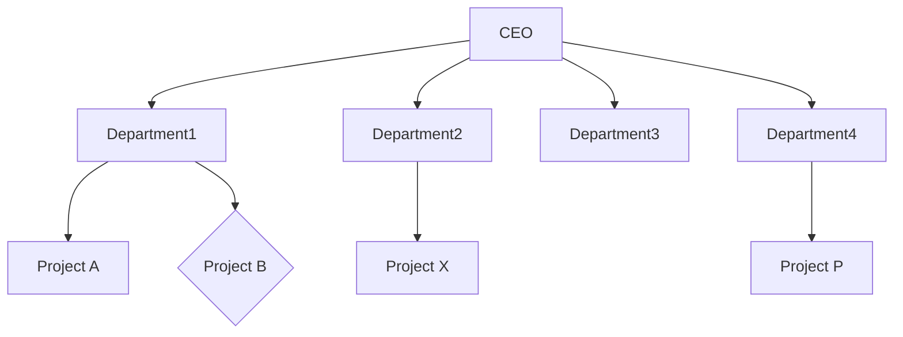
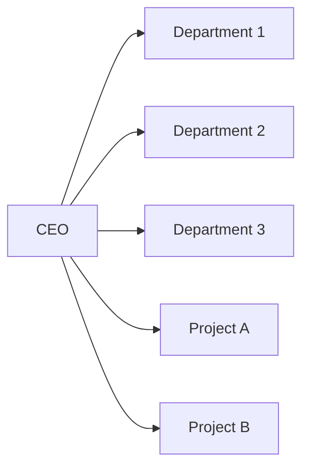
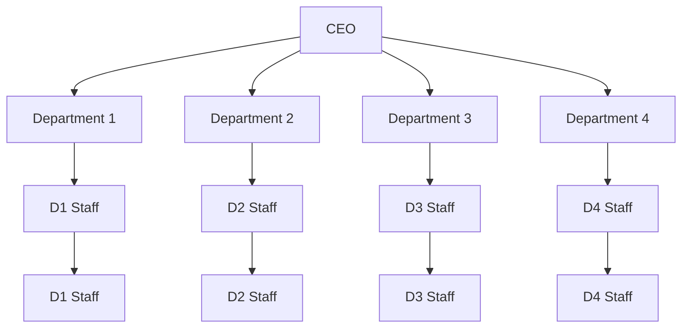

- **2 Hours**
- **4 Marks**
# 1 Organization
- An organization is a group of people with diverse knowledge and skills working together to achieve a common organizational goal.
- Projects can't be run in isolation.
- They must operate within a broader organizational environment.
- Project managers need to take a holistic or systems view of a project and understand how it fits within the larger organization.
- Success depends not only on managing the project itself but also on navigating organizational structures, politics, and culture.
## 1.1 Types of Organization
1. **Line Organization:** A simple, direct chain of command from top to bottom. Authority flows vertically.
2. **Line and Staff Organization:** Combines line managers with authority and staff specialists who provide advice and support.
3. **Functional Organization:** Groups people by specialized functions (e.g., marketing, engineering, finance). This is a common structure for ongoing operations.
4. **Project Organization:** An organizational structure built around projects, where teams are formed specifically for project work.
# 2 System view of project management
- A  **project management system** is an organized set of tools, procedures, and practices that help managers and teams achieve project goals.
- It provides a structured framework for managing complexity.
## 2.1 Three parts of a System View
| Component              | Description                                                                                                                                                                 |
| ---------------------- | --------------------------------------------------------------------------------------------------------------------------------------------------------------------------- |
| **System Philosophy**  | Viewing things as interconnected systems—interacting components working within an environment to fulfill a purpose. This emphasizes that changes in one area affect others. |
| **System Analysis**    | A problem-solving approach that examines the components of a system and their interactions to identify improvements or solutions.                                           |
| **Systems Management** | Addresses business, technological, and organizational issues before making changes to systems, ensuring holistic consideration of impacts                                   |
## 2.2 Three Core Areas of Systems View
| Core Area        | Key Questions                                                                                                                                                                                                                    |
| ---------------- | -------------------------------------------------------------------------------------------------------------------------------------------------------------------------------------------------------------------------------- |
| **Business**     | How much will it cost? Where will funds come from? Who are the stakeholders? What will be the profit or return on investment?                                                                                                    |
| **Organization** | What are the tangible and intangible benefits? What are the short-term and long-term effects? What skills and facilities are required? How will resources be mobilized? What resource development is needed?                     |
| **Technology**   | Which technology will be used and why? What software, hardware, and network are required? Is it proven technology or obsolete? Where will technological support come from? How will the project cope with technological changes? |
## 2.3 Three Key Essences
| Essence                  | Description                                                                                                        |
| ------------------------ | ------------------------------------------------------------------------------------------------------------------ |
| **Structured Approach**  | A defined organizational structure that clarifies roles, responsibilities, and reporting relationships.            |
| **Disciplined Approach** | A coordinated management process with consistent practices, controls, and governance.                              |
| **Defined Approach**     | Purposefully defined inputs, processes, and outputs for each project activity, ensuring clarity and repeatability. |
# 3 Organizational Structure of Project
- The organizational structure 
	- defines 
		- formal relationships, 
		- lines of communication, 
		- and the flow of responsibilities and authority 
	- through the management hierarchy.
- The choice of structure significantly impacts project success.
## 3.1 Functional Organization

**Description:**
- Project tasks are performed within existing functional departments.
- The head of the functional department acts as the project manager (or no designated PM exists).
- May have a project coordinator with limited authority, but no dedicated project staff.
**Suitability:** Small projects, projects confined to a single department.

| Advantages                                     | Disadvantages                                  |
| ---------------------------------------------- | ---------------------------------------------- |
| Flexibility in use of existing human resources | Lack of project focus                          |
| High specialization and technical expertise    | Decision-making delays due to hierarchy        |
| Access to functional knowledge and experience  | Poor cross-departmental communication          |
| Clear career paths for team members            | Team members lack a global view of the project |
## 3.2 Pure Project Organization

**Description:**
- Project organization is separate from functional units.
- The project manager has their own line organization with full authority and responsibility.
- Projects report directly to the head of the organization (e.g., CEO).
**Suitability:** Large, complex, high-priority projects.

|Advantages|Disadvantages|
|---|---|
|Strong focus on project objectives|Duplication of facilities, equipment, and efforts across projects|
|Clear, unambiguous authority for the PM|Lack of job security for team members after project ends|
|Effective, direct communication within the project|Potential conflict between project and non-project staff|
|Efficient use of labor force dedicated to the project|Not cost-effective for small or short-term projects|
## 3.3 Matrix Organization

- Here, Project manager 1 handles first level of staff
- Project Manager 2 handles second level of staff
**Description:**
- A combination of functional and pure project structures.
- A temporary project structure is imposed over the existing functional design.
- Project team members are assigned from functional departments and report to both the project manager and their functional manager.
**Suitability:** Medium to large projects, organizations with multiple concurrent projects.

|Advantages|Disadvantages|
|---|---|
|Strong focus on project objectives|Dual command structure (multiple reporting lines)|
|Enhanced coordination between PM and department heads|Duplication of work for functional departments|
|Flexibility in resource allocation|Potential for conflict and power struggles between PM and functional managers|
|Efficient use of resources across multiple projects|Requires high interpersonal and negotiation skills|
|Team feeling and motivation|Can be expensive due to additional management overhead|
|Opportunity for skill enhancement through diverse projects||
|Frees top management from day-to-day project details||
### 3.3.1 Types
| Type                | Authority Balance            | PM Role                          | Description                                                                                                                       |
| ------------------- | ---------------------------- | -------------------------------- | --------------------------------------------------------------------------------------------------------------------------------- |
| **Weak Matrix**     | Functional Manager dominates | Project Coordinator or Expediter | PM has limited authority; primarily facilitates, tracks progress, and negotiates with functional managers who control resources.  |
| **Balanced Matrix** | Power is balanced            | Project Manager                  | PM and functional manager share authority. PM defines project needs; functional manager provides support and resources.           |
| **Strong Matrix**   | Project Manager dominates    | Project/Program Manager          | PM has significant authority over resources and decisions. Functional managers provide technical expertise and support as needed. |
# 4 Organizational Structure Influences on Projects
| Project Characteristic                                | Functional Organization      | Weak Matrix                  | Balanced Matrix           | Strong Matrix                     | Pure Project (Projectized)        |
| ----------------------------------------------------- | ---------------------------- | ---------------------------- | ------------------------- | --------------------------------- | --------------------------------- |
| **PM's Authority**                                    | Little or None               | Limited                      | Low to Moderate           | Moderate to High                  | High to Full                      |
| **Team Member Involvement from Overall Organization** | Virtually None (0%)          | 0-25%                        | 15-60%                    | 50-95%                            | 85-100%                           |
| **PM's Role**                                         | Part-time                    | Part-time                    | Full-time                 | Full-time                         | Full-time                         |
| **Common Title for PM Role**                          | Project Coordinator / Leader | Project Coordinator / Leader | Project Manager / Officer | Project Manager / Program Manager | Project Manager / Program Manager |
| **PM's Administrative Staff**                         | Part-time                    | Part-time                    | Full-time                 | Full-time                         | Full-time                         |
- The choice of organizational structure directly affects the project manager's authority, resource availability, and overall project dynamics.
- As you move from Functional to Projectized, the project manager's **authority increases**.
- **Resource dedication** to the project increases along the same spectrum.
- The PM's role transitions from **part-time coordination** to **full-time management**.
- The organizational structure provides the top-level view of **ownership structure** and the **main line of reporting** for the project.
## 4.1 Comparison
| Structure           | PM Authority | Resource Availability             | Best For                                       | Key Challenge                                  |
| ------------------- | ------------ | --------------------------------- | ---------------------------------------------- | ---------------------------------------------- |
| **Functional**      | Minimal      | Shared across functions           | Small, single-department projects              | Lack of project focus                          |
| **Weak Matrix**     | Limited      | Shared, negotiated                | Projects with strong functional control        | Dual reporting, limited PM power               |
| **Balanced Matrix** | Moderate     | Shared, collaborative             | Medium projects needing cross-functional input | Power balance requires strong negotiation      |
| **Strong Matrix**   | High         | Dedicated with functional support | Large, complex projects                        | Potential conflict, management overhead        |
| **Pure Project**    | Full         | Fully dedicated                   | Large, high-priority, standalone projects      | Resource duplication, post-project uncertainty |
